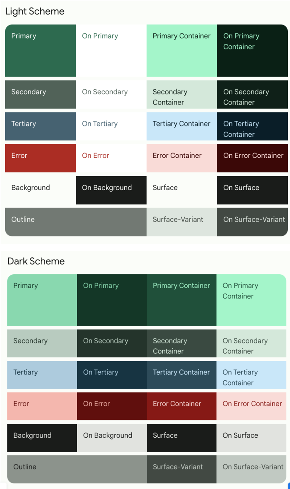
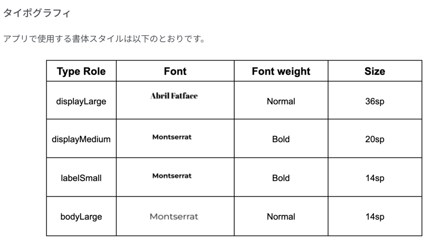
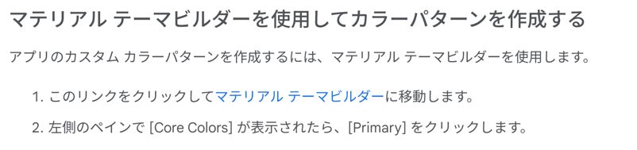
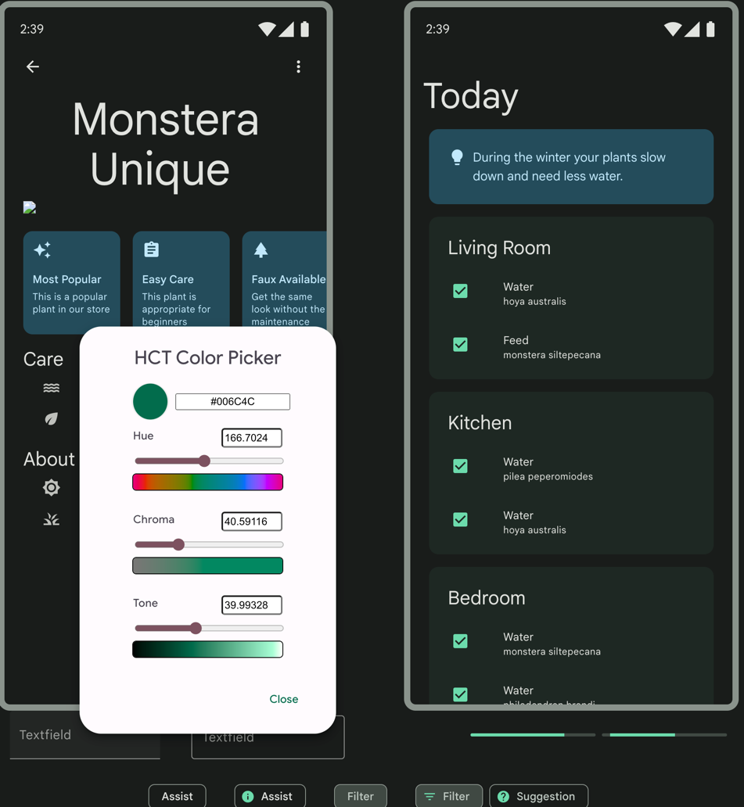
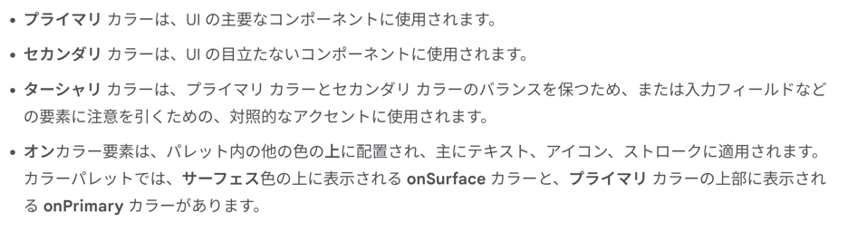
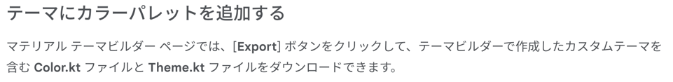
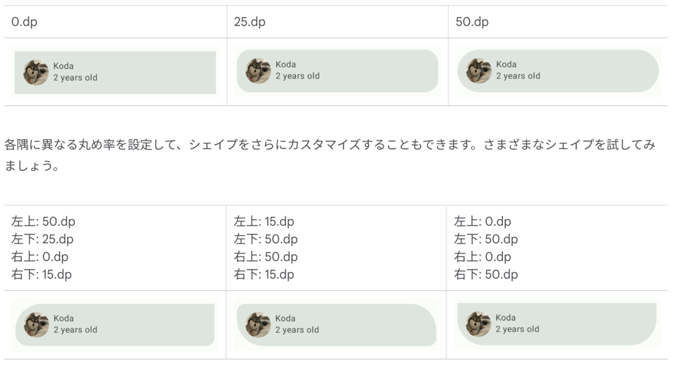
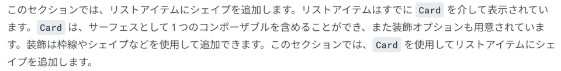

完成物イメージ


タイポグラフィ

### マテリアルテーマ設定と色の追加



[マテリアルテーマビルダー](https://m3.material.io/theme-builder#/custom)の Primary で primaryColor を設定すると、



こんな感じでいい感じのカラー配置をしてくれる。



それぞれの役割の説明と活用方法↑



アプリへの導入方法

### シェイプを追加する

```kotlin
import androidx.compose.foundation.shape.RoundedCornerShape
import androidx.compose.material3.Shapes
import androidx.compose.ui.unit.dp

val Shapes = Shapes(
    small = RoundedCornerShape(50.dp),
    medium = RoundedCornerShape(bottomStart = 16.dp, topEnd = 16.dp)
)
```
こんな感じで定義


こういうこともできる


カードコンポーネントはサーフェスとして一つのコンポーザブルを含めることができて、修飾オプションも用意されているんだってさ
枠線、シェイプなどを追加できる。

Row, Column, LazyColumn, LazyRow, Text, Image あたりは固有の役割がわかりやすかった。
だから、Card とか Surface とかの存在意義が謎だったが、要するに修飾するのに便利だよねって話なんだねと。

