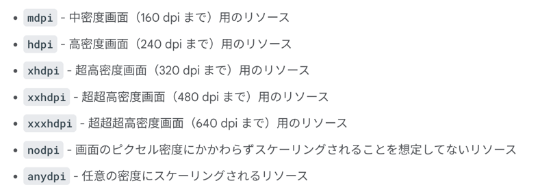
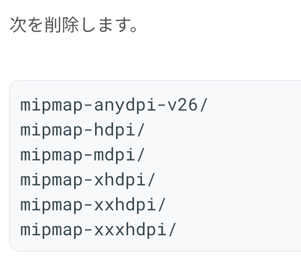
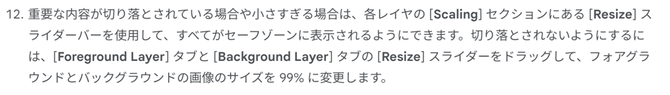
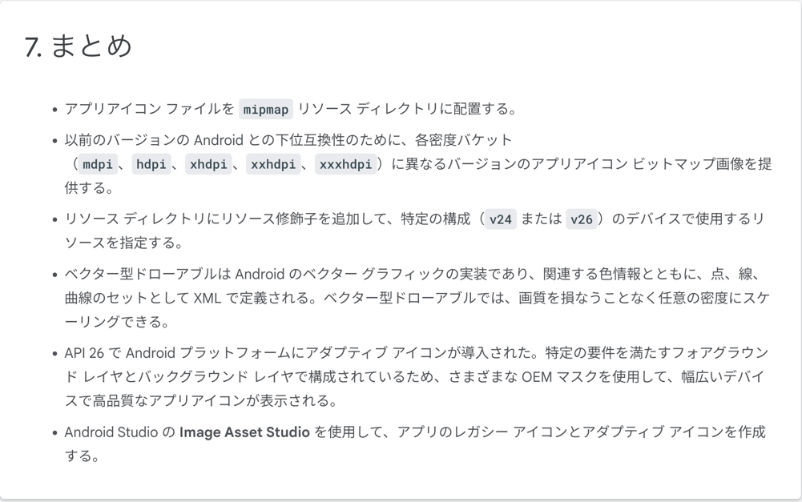

## ランチャーアイコン
画面密度: 画面上の一インチあたりのピクセル数(1インチあたりのドットの数)のこと
mdpi, hdpi, xhdpi: 密度修飾子のこと

## アダプティブアイコン
-26 リソース修飾子のついた mipmap リソースディレクトリで宣言する必要がある

## アダプティブアイコン設定時の注意点
フォアグラウンドアセットもバックグラウンドアセットもサイズは 108dpi ✖️ 108dpi である必要がある。
フォアグラウンドレイアにはセーフゾーンがあり、66dpi の円形になっている。
見せたいデザインはこの円の中に納める必要がある。

