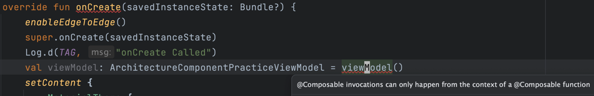

### ビジネスロジックを Ui から ViewModel へ移行する

codelab で学んだこの方法は Composable 関数の中でしか呼べない。
ViewModel() 自体が Compose 関数なので。

#### viewModelAndStateInCompose で学んだこと

- State に切り分けるか、ViewModel のメンバーとしてもつか？をどう判断するか？
  1. ユーザー操作で画面内のミュータブル要素については ViewModel のメンバとして持っていれば良さそう
  2. 反対に、イミュータブル(ユーザー操作などに影響されない)要素については、State に切り分けて良さそう 
     1. ViewModel からも安易に変更できないようにね