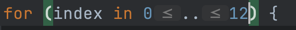

### ビジネスロジックを Ui から ViewModel へ移行する

codelab で学んだこの方法は Composable 関数の中でしか呼べない。
ViewModel() 自体が Compose 関数なので。

#### viewModelAndStateInCompose で学んだこと

- State に切り分けるか、ViewModel のメンバーとしてもつか？をどう判断するか？
  1. ユーザー操作で画面内のミュータブル要素については ViewModel のメンバとして持っていれば良さそう
  2. 反対に、イミュータブル(ユーザー操作などに影響されない)要素については、State に切り分けて良さそう 
     1. ViewModel からも安易に変更できないようにね

### 答え合わせで気づいたこと
- 20分程度でやった割に、前回学んだことを活かした実装は悪くなかったし、仕様を満たせていた(と思う)
- ViewModel に切り離したメソッドの理解が一部雑だった気はする、これとか↓
  - 
      - 出力: 0..12
      - これ↓の代替
      - 
- データを Ui 層で扱っちゃダメだよ、State クラスで完全に秘匿しよう
  - なんのために State でリストのインデックスを持っているんですか？ってこと

### 答え合わせでちょっと突っ込みたいこと
- determineDessertIndex() をクリックイベントが起きるたびに毎回叩くのはいかがなものか？と思った
  - それなら、State にデザートの amount を保存しておいて、それを ViewModel から参照して余計に叩かなくて済むようにしない？
  - 次のコミットで修正してみる