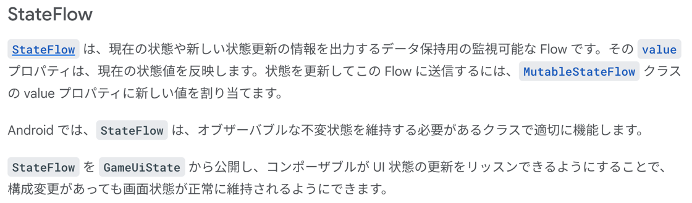
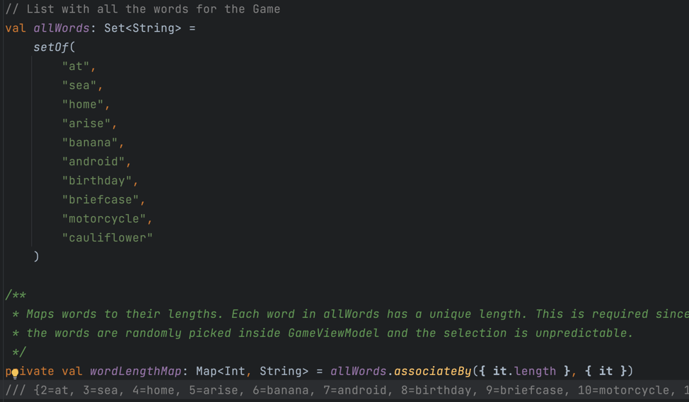

### Viewmodel 
普通に ViewModel

### StateFlow



```kotlin
    private val _uiState = MutableStateFlow(GameUiState())
    val uiState: StateFlow<GameUiState> = _uiState.asStateFlow()
```

やっていることは以下とほぼ同じ。_mutableList が元データで、list に代入する際に toList で immutable にして _mutableList の変更を防ぐ。
元の GameUiState を保護するために asStateFlow で読み取り専用にするイメージ。

```kotlin
    private val _mutableList = mutableListOf(1,2,3)
    val list = _mutableList.toList()
```

WordData.kt をコピーした時の面白い関数見つけた
