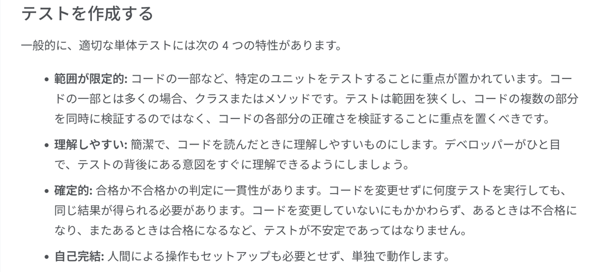
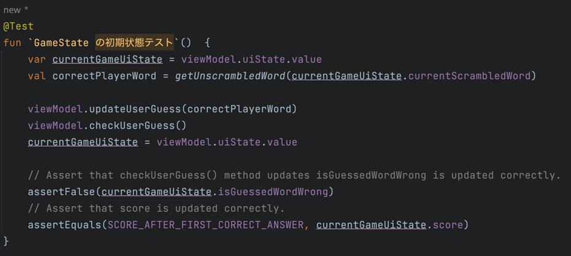
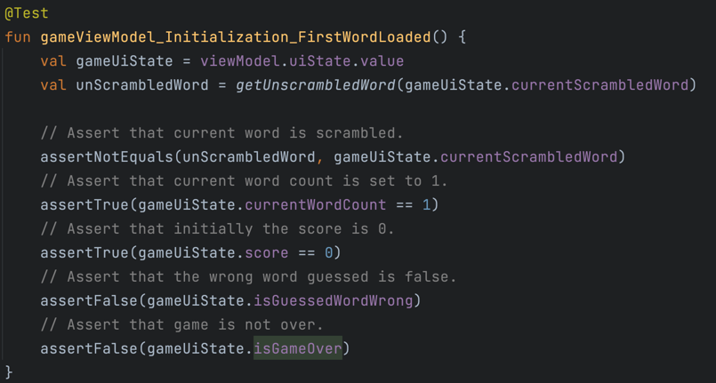
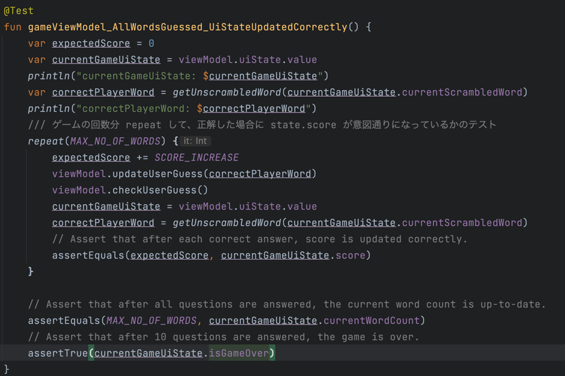
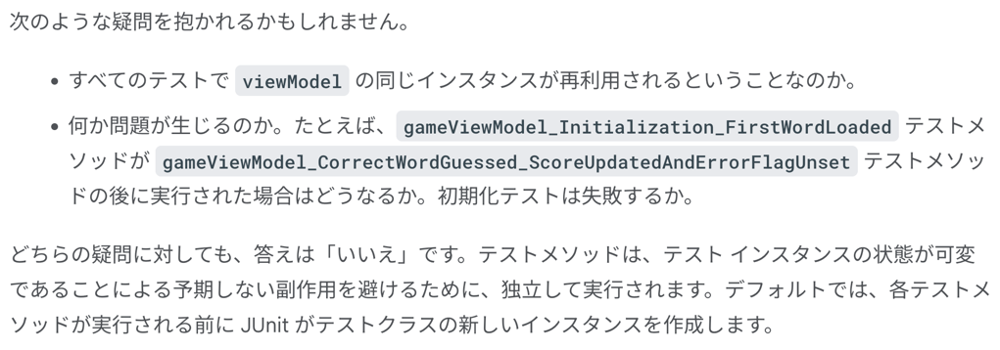
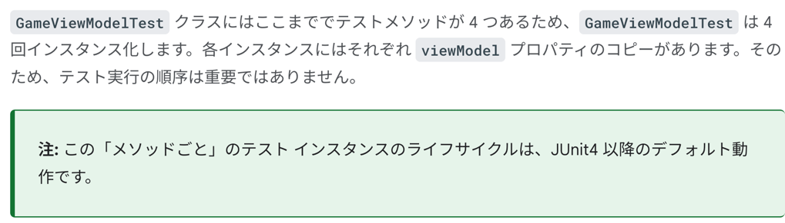
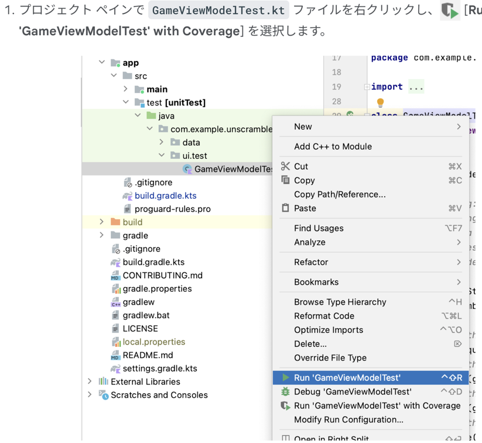
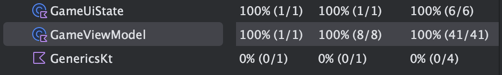

### テストケース



### 正常系？


### 異常系？


### repeat 系


### テストインスタンスのライフサイクルの概要

```kotlin
class GameViewModelTest {
    private val viewModel = GameViewModel()

    @Test
    fun gameViewModel_Initialization_FirstWordLoaded() {
        val gameUiState = viewModel.uiState.value
        ...
    }
    ...
}
```

Question
- すべてのテストで viewModel の同じインスタンスが再利用されるということなのか。
- 何か問題が生じるのか。たとえば、gameViewModel_Initialization_FirstWordLoaded テストメソッドが gameViewModel_CorrectWordGuessed_ScoreUpdatedAndErrorFlagUnset テストメソッドの後に実行された場合はどうなるか。初期化テストは失敗するか。

Answer
NO
テストメソッドはテストインスタンスの状態が可変であることによる予期しない副作用を避けるため、独立して実行される。とのことです
ただし、JUnit4 以降の挙動。とのこと。





### テストカバレッジ






めっちゃ大事なこと。
```kotlin
アプリコードのコード カバレッジを実行、分析、改善する方法を学習しました。

コード カバレッジの割合が高ければ、アプリコードの質が高いということになるのでしょうか。そうではありません。コード カバレッジは、単体テストでカバー（実行）されたコードの割合を示すもので、コードが検証されたことを示しているわけではありません。単体テストのコードからすべてのアサーションを削除してコード カバレッジを実行しても、カバレッジは 100% と表示されます。

カバレッジが高いことは、テストが正しく設計されていることや、アプリの動作が検証されていることを示すわけではありません。作成したテストに、テストするクラスの動作を検証するアサーションがあることを確認する必要があります。また、アプリ全体でテスト カバレッジ 100% を実現するように単体テストを作成する必要はありません。アクティビティなど、アプリのコードの一部は UI テストでテストする必要があります。

ただし、カバレッジが低いということは、コードの大部分がまったくテストされていないことを意味します。コード カバレッジは、コードの品質を測定するツールではなく、テストで実行されなかったコードの部分を見つけるツールとして使用してください。
```