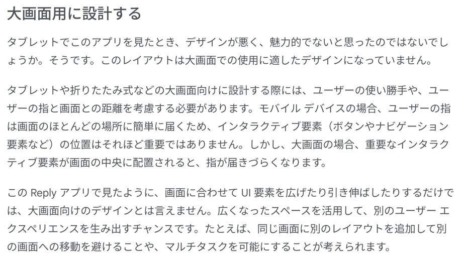
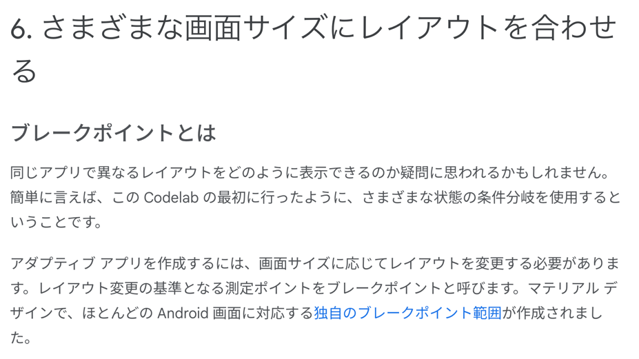
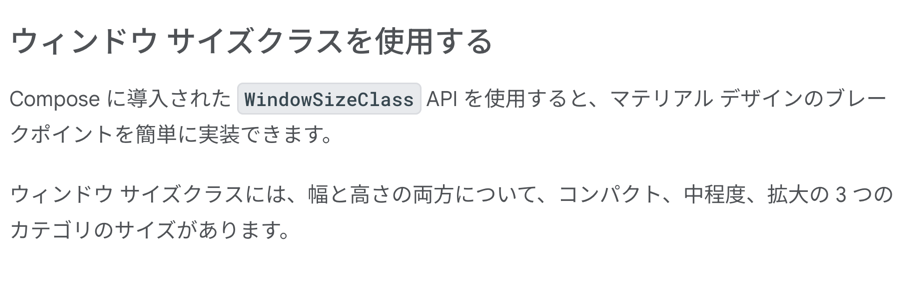
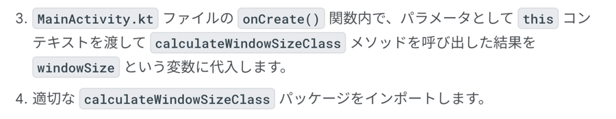
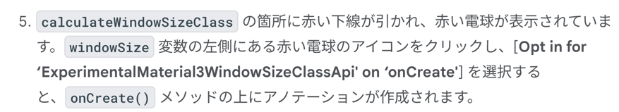
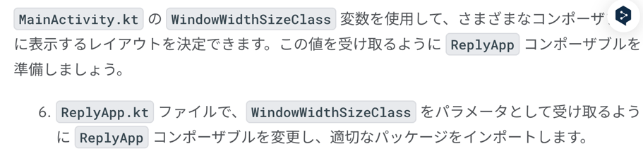
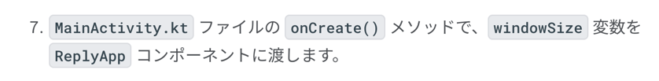
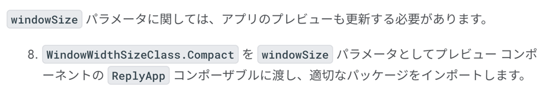
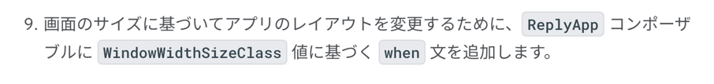

### 様々な画面サイズに対応する

これを求められたプロジェクトがあんまりないからパス。
動画は見た。

https://developer.android.com/courses/pathways/android-basics-compose-unit-4-pathway-3?hl=ja



大画面用に設計しようねって話し。



どうやってやるのか？
動画で話していたように activity から画面サイズを取得して条件分岐するよ。



### 導入方法

```kotlin
...
dependencies {
...
"androidx.compose.material3:material3-window-size-class:$material3_version"
...
```



```kotlin
import androidx.compose.material3.windowsizeclass.calculateWindowSizeClass
        

override fun onCreate(savedInstanceState: Bundle?) {
    super.onCreate(savedInstanceState)

    setContent {
        ReplyTheme {
            val windowSize = calculateWindowSizeClass(this)
            ReplyApp()
        }
    }
}
```



```text
このエラー メッセージが表示される理由は、現在 material3-window-size-class API が、このアノテーションを必要とするアルファ版バージョンであるためです。
```



```kotlin
import androidx.compose.material3.windowsizeclass.WindowWidthSizeClass

@Composable
fun ReplyApp(
    windowSize: WindowWidthSizeClass,
    modifier: Modifier = Modifier
) {}
```




```kotlin

         setContent {
            ReplyTheme {
                val windowSize = calculateWindowSizeClass(this)
                ReplyApp(
                    windowSize = windowSize.widthSizeClass
                )
            }
         }
```



```kotlin
@Preview(showBackground = true)
@Composable
fun ReplyAppPreview() {
    ReplyTheme {
        ReplyApp(
            windowSize = WindowWidthSizeClass.Compact,
        )
    }
}
```



```kotlin
@Composable
fun ReplyApp(
    windowSize: WindowWidthSizeClass,
    modifier: Modifier = Modifier
) {
    val viewModel: ReplyViewModel = viewModel()
    val replyUiState = viewModel.uiState.collectAsState().value

    when (windowSize) {
        WindowWidthSizeClass.Compact -> {
        }
        WindowWidthSizeClass.Medium -> {
        }
        WindowWidthSizeClass.Expanded -> {
        }
        else -> {
        }
    }
}
```

### アダプティブ ナビゲーション レイアウトを実装する

こっちは後ででいいや。とりあえず、Composable 関数に画面サイズを渡してそれ相応の UI を出そうねって話だけインデックスできていればいい。