### ルート定義
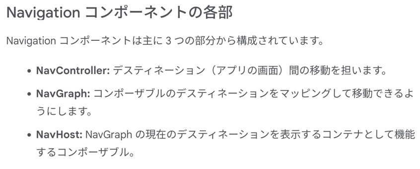

イメージは URL と同様とのことなので、Webアプリの root と同じような発想で良さそう。

### NavHost

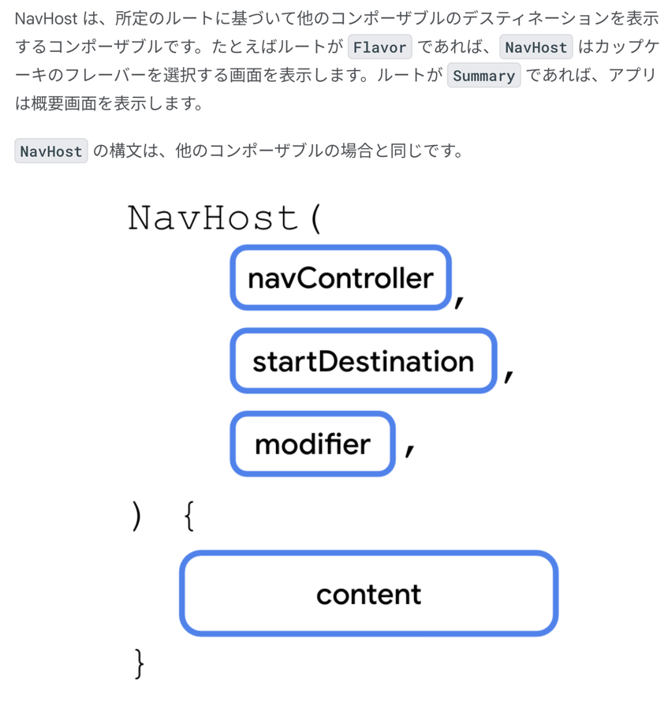

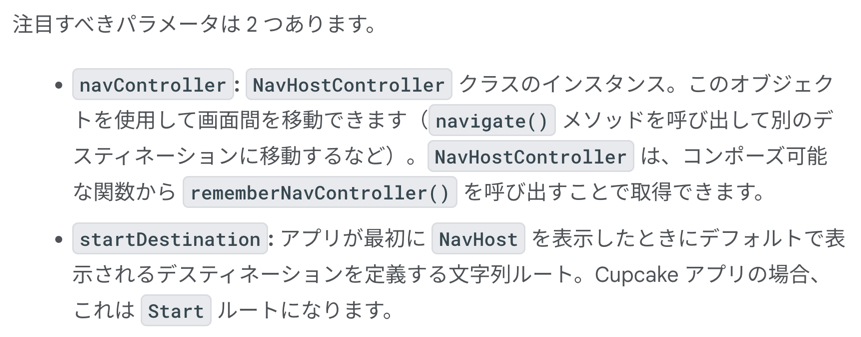

- 設定方法
enum で定義した画面の名称に対して Navhost でルートを指定してあげた感じ。
実際のルート間移動はこの後に実装
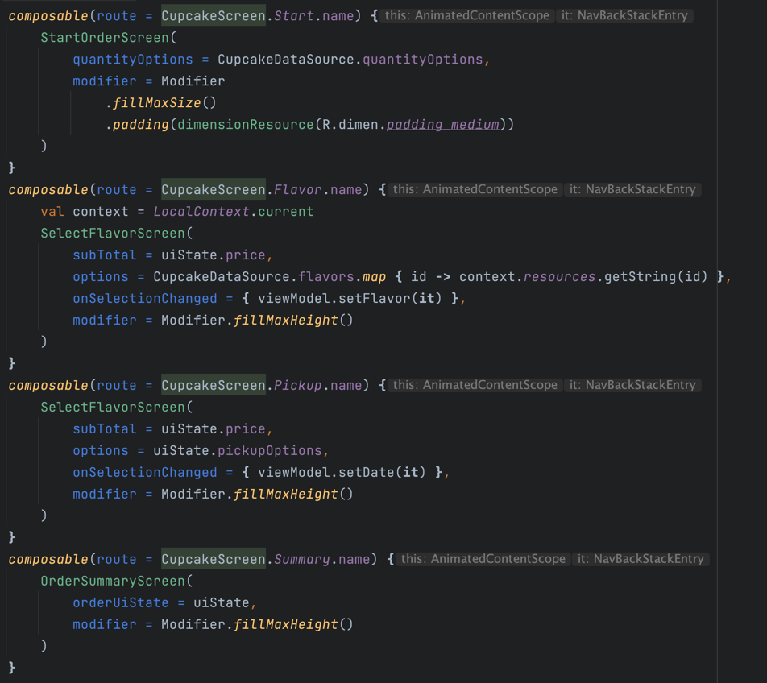

- 別のルートに移動

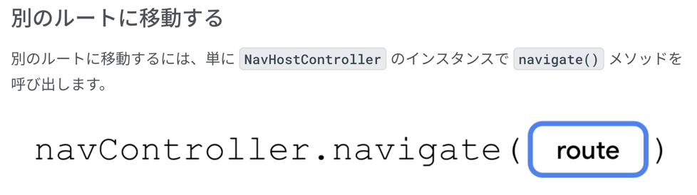

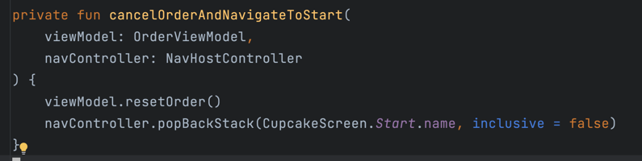

の

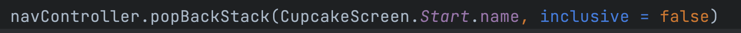

で、Stack に貯めていた画面を破棄して、指定した画面に戻ることができるよと。
Fragment の popbackstack と似ているよねと。

### 別のアプリに移動する

Intent とか使うやつかな
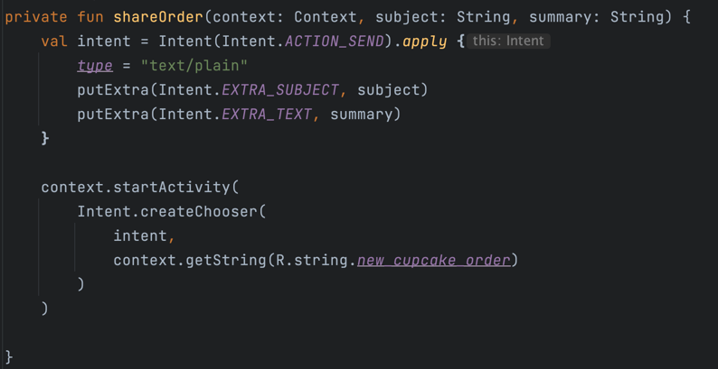

### 戻るボタン(OS標準とは別で Appbar に出すやつ)

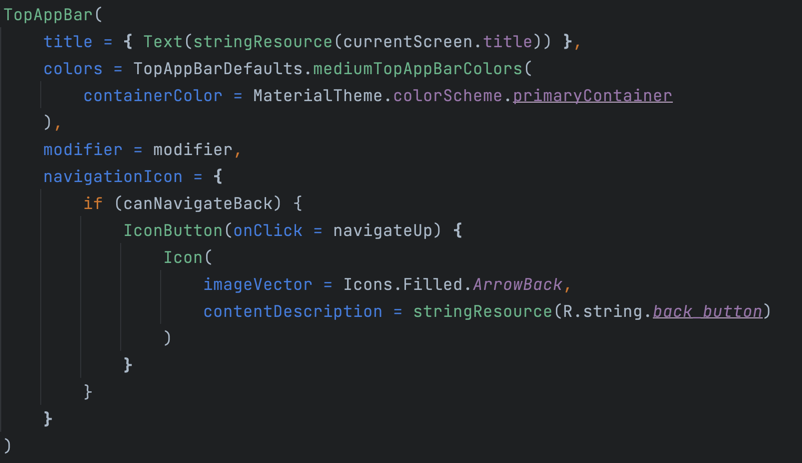

呼び出す側で色々やっているのでこれも参考になりそうだよ
特に、画面に対応する画面名を AppBar に表示する際に使っている、バックスタックに積まれている情報を取得するところとかね。

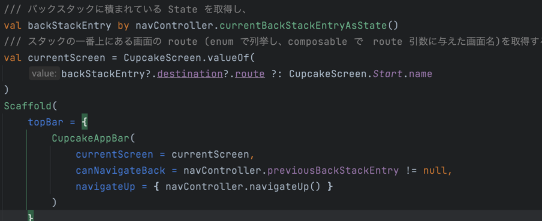

スタックの状態を確認する処理を書きはするんだけど、結局戻るボタンを押した時の挙動はこれで管理するのが妥当のようだね。

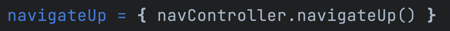

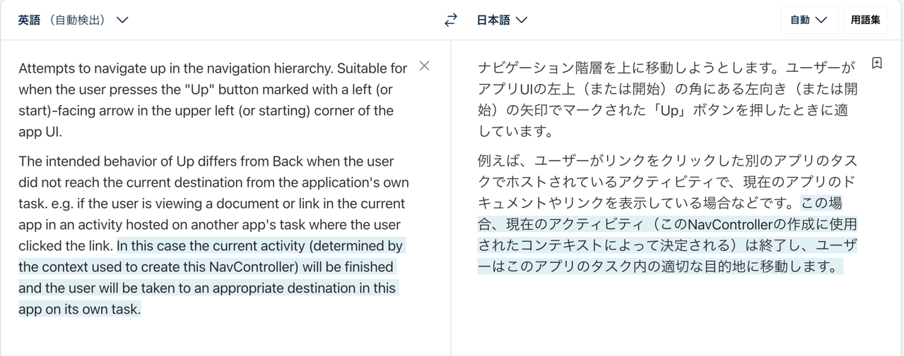