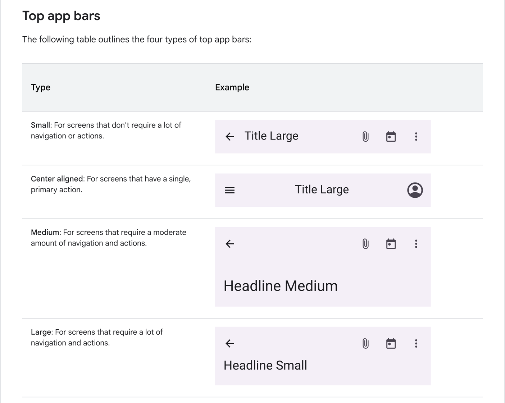

### AppBar の復習



```kotlin
Small: For screens that don't require a lot of navigation or actions.
Center aligned: For screens that have a single, primary action.
Medium: For screens that require a moderate amount of navigation and actions.
Large: For screens that require a lot of navigation and actions.
```