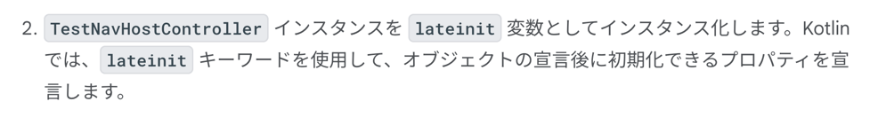

### やること
- UI のテスト
  - 特に、Navhost のテスト
- UI テストはそこまで QA の工数を減らせるものではないと思うので斜め読みでいいかな。。
  - 遷移, input, submit, validation までテストできるならそれはやったほうがいいと思うけど

import

```kotlin
androidTestImplementation(platform("androidx.compose:compose-bom:2023.05.01"))
androidTestImplementation("androidx.compose.ui:ui-test-junit4")
androidTestImplementation("androidx.navigation:navigation-testing:2.6.0")
androidTestImplementation("androidx.test.espresso:espresso-intents:3.5.1")
androidTestImplementation("androidx.test.ext:junit:1.1.5")
```


実際に書いた NavHostController にはアクセス不能だが、testNabHostController を使えばテストルールを構成することはできるらしい。


```kotlin
import androidx.activity.ComponentActivity
import androidx.compose.ui.test.junit4.createAndroidComposeRule
import org.junit.Rule

@get:Rule
val composeTestRule = createAndroidComposeRule<ComponentActivity>()
```



```kotlin
import androidx.navigation.testing.TestNavHostController

private lateinit var navController: TestNavHostController
```


```kotlin
import com.example.cupcake.CupcakeApp

fun setupCupcakeNavHost() {
    composeTestRule.setContent {
        CupcakeApp()
    }
}
```


```kotlin
import androidx.compose.ui.platform.LocalContext

fun setupCupcakeNavHost() {
    composeTestRule.setContent {
        navController = TestNavHostController(LocalContext.current).apply {
            navigatorProvider.addNavigator(ComposeNavigator())
        }
        CupcakeApp(navController = navController)
    }
}
```


Navigation の設定をテストごとに行うのではなく、@Before で初期化しちゃおう


どのアプリでも Home 画面があるよね、最初の route がホーム画面になっているのかをテストしよう

```kotlin
import org.junit.Test

@Test
fun cupcakeNavHost_verifyStartDestination() {
}
```


```kotlin
import org.junit.Assert.assertEquals

@Test
fun cupcakeNavHost_verifyStartDestination() {
    assertEquals(CupcakeScreen.Start.name, navController.currentBackStackEntry?.destination?.route)
}
```


重要なのはここ。重複コードを防ごうねって話し。
```kotlin
前のセクションで記述したアサーションは、多くのコードを必要とします。Cupcake アプリでナビゲーションをテストするときは、同じアサーションを何度も使用します。このような場合は、テストにヘルパー メソッドを作成すると、コードを重複して記述せずに済みます。
```


```kotlin
fun NavController.assertCurrentRouteName(expectedRouteName: String) {
}
```


```kotlin
import org.junit.Assert.assertEquals

fun NavController.assertCurrentRouteName(expectedRouteName: String) {
    assertEquals(expectedRouteName, currentBackStackEntry?.destination?.route)
}
```


```kotlin
@Test
fun cupcakeNavHost_verifyStartDestination() {
    navController.assertCurrentRouteName(CupcakeScreen.Start.name)
}
```

この書き方おもんないな。。楽しくない。。プログラムを読んでるほうが楽だし楽しいんだよな。そうしよ
これが CupcakeScreen(ホーム画面)の UI テスト。


### ホーム画面テスト

```kotlin
/*
 * Copyright (C) 2023 The Android Open Source Project
 *
 * Licensed under the Apache License, Version 2.0 (the "License");
 * you may not use this file except in compliance with the License.
 * You may obtain a copy of the License at
 *
 *      https://www.apache.org/licenses/LICENSE-2.0
 *
 * Unless required by applicable law or agreed to in writing, software
 * distributed under the License is distributed on an "AS IS" BASIS,
 * WITHOUT WARRANTIES OR CONDITIONS OF ANY KIND, either express or implied.
 * See the License for the specific language governing permissions and
 * limitations under the License.
 */
package com.example.cupcake.test

import android.icu.util.Calendar
import androidx.activity.ComponentActivity
import androidx.compose.ui.platform.LocalContext
import androidx.compose.ui.test.junit4.createAndroidComposeRule
import androidx.compose.ui.test.onNodeWithContentDescription
import androidx.compose.ui.test.onNodeWithText
import androidx.compose.ui.test.performClick
import androidx.navigation.compose.ComposeNavigator
import androidx.navigation.testing.TestNavHostController
import com.example.cupcake.CupcakeApp
import com.example.cupcake.CupcakeScreen
import com.example.cupcake.R
import org.junit.Before
import org.junit.Rule
import org.junit.Test
import java.text.SimpleDateFormat
import java.util.Locale

class CupcakeScreenNavigationTest {

    /**
     * Note: To access to an empty activity, the code uses ComponentActivity instead of
     * MainActivity.
     */
    @get:Rule
    val composeTestRule = createAndroidComposeRule<ComponentActivity>()

    private lateinit var navController: TestNavHostController

    /// テスト用　Navhost　の準備 
    @Before
    fun `Navhost準備`() {
        composeTestRule.setContent {
            navController = TestNavHostController(LocalContext.current).apply {
                navigatorProvider.addNavigator(ComposeNavigator())
            }
            CupcakeApp(navController = navController)
        }
    }

    @Test
    fun `最初の画面がStart`() {
        navController.assertCurrentRouteName(CupcakeScreen.Start.name)
    }

    /// 
    @Test
    fun `戻るボタンをHome画面では表示していない`() {
        val backText = composeTestRule.activity.getString(R.string.back_button)
        composeTestRule.onNodeWithContentDescription(backText).assertDoesNotExist()
    }

    @Test
    fun `OneCupcakeタップ時にFlavor画面に遷移する`() {
        composeTestRule.onNodeWithStringId(R.string.one_cupcake)
            .performClick()
        navController.assertCurrentRouteName(CupcakeScreen.Flavor.name)
    }

    @Test
    fun `nextタップ時にPickup画面に遷移する`() {
        navigateToFlavorScreen()
        composeTestRule.onNodeWithStringId(R.string.next)
            .performClick()
        navController.assertCurrentRouteName(CupcakeScreen.Pickup.name)
    }

    @Test
    fun `Pickup画面で戻るボタンタップ時、Start画面に戻る`() {
        navigateToFlavorScreen()
        performNavigateUp()
        navController.assertCurrentRouteName(CupcakeScreen.Start.name)
    }

  
    @Test
    fun cupcakeNavHost_clickCancelOnFlavorScreen_navigatesToStartOrderScreen() {
        navigateToFlavorScreen()
        composeTestRule.onNodeWithStringId(R.string.cancel)
            .performClick()
        navController.assertCurrentRouteName(CupcakeScreen.Start.name)
    }

    @Test
    fun cupcakeNavHost_clickNextOnPickupScreen_navigatesToSummaryScreen() {
        navigateToPickupScreen()
        composeTestRule.onNodeWithText(getFormattedDate())
            .performClick()
        composeTestRule.onNodeWithStringId(R.string.next)
            .performClick()
        navController.assertCurrentRouteName(CupcakeScreen.Summary.name)
    }

    @Test
    fun cupcakeNavHost_clickBackOnPickupScreen_navigatesToFlavorScreen() {
        navigateToPickupScreen()
        performNavigateUp()
        navController.assertCurrentRouteName(CupcakeScreen.Flavor.name)
    }

    @Test
    fun cupcakeNavHost_clickCancelOnPickupScreen_navigatesToStartOrderScreen() {
        navigateToPickupScreen()
        composeTestRule.onNodeWithStringId(R.string.cancel)
            .performClick()
        navController.assertCurrentRouteName(CupcakeScreen.Start.name)
    }

    @Test
    fun cupcakeNavHost_clickCancelOnSummaryScreen_navigatesToStartOrderScreen() {
        navigateToSummaryScreen()
        composeTestRule.onNodeWithStringId(R.string.cancel)
            .performClick()
        navController.assertCurrentRouteName(CupcakeScreen.Start.name)
    }

    private fun navigateToFlavorScreen() {
        composeTestRule.onNodeWithStringId(R.string.one_cupcake)
            .performClick()
        composeTestRule.onNodeWithStringId(R.string.chocolate)
            .performClick()
    }

    private fun navigateToPickupScreen() {
        navigateToFlavorScreen()
        composeTestRule.onNodeWithStringId(R.string.next)
            .performClick()
    }

    private fun navigateToSummaryScreen() {
        navigateToPickupScreen()
        composeTestRule.onNodeWithText(getFormattedDate())
            .performClick()
        composeTestRule.onNodeWithStringId(R.string.next)
            .performClick()
    }

    private fun performNavigateUp() {
        val backText = composeTestRule.activity.getString(R.string.back_button)
        composeTestRule.onNodeWithContentDescription(backText).performClick()
    }

    private fun getFormattedDate(): String {
        val calendar = Calendar.getInstance()
        calendar.add(java.util.Calendar.DATE, 1)
        val formatter = SimpleDateFormat("E MMM d", Locale.getDefault())
        return formatter.format(calendar.time)
    }
}
```

やっていることを一部コメントで表現したが、つまり Navhost の遷移が正しいか？戻るボタンや、その画面でタップしたボタン要素によって Navhost に正しく画面名が Stack されているか？を検証するテスト。
そこまでやる必要あるか？と思ってしまう点はままある。

### ヘルパー関数

```kotlin
/*
 * Copyright (C) 2023 The Android Open Source Project
 *
 * Licensed under the Apache License, Version 2.0 (the "License");
 * you may not use this file except in compliance with the License.
 * You may obtain a copy of the License at
 *
 *      https://www.apache.org/licenses/LICENSE-2.0
 *
 * Unless required by applicable law or agreed to in writing, software
 * distributed under the License is distributed on an "AS IS" BASIS,
 * WITHOUT WARRANTIES OR CONDITIONS OF ANY KIND, either express or implied.
 * See the License for the specific language governing permissions and
 * limitations under the License.
 */
package com.example.cupcake.test

import androidx.navigation.NavController
import org.junit.Assert

/// 拡張関数、
fun NavController.assertCurrentRouteName(expectedRouteName: String) {
    Assert.assertEquals(expectedRouteName, currentBackStackEntry?.destination?.route)
}
```

### 感想
NavHost のテストってこうやればいいんだね！実務で必要ならここを参照しようね！以上。