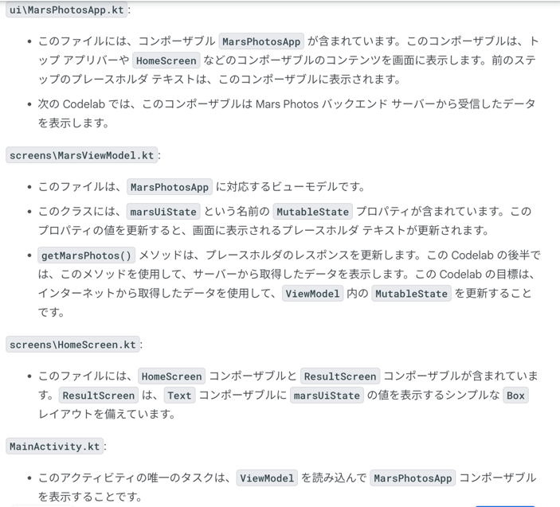
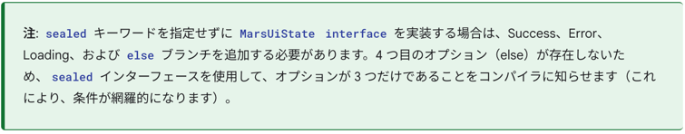
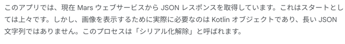
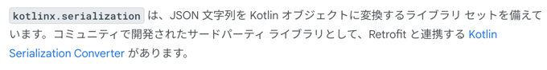
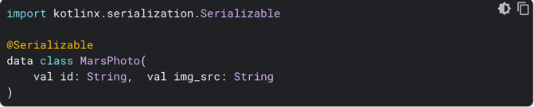
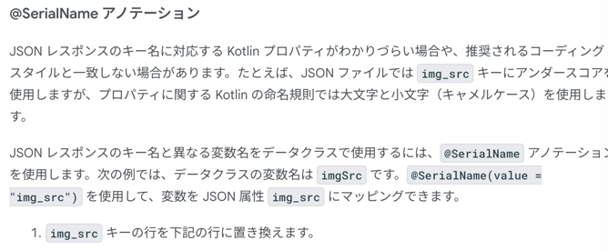

### ディレクトリ構成



### Retrofit

```kotlin
// Retrofit
implementation("com.squareup.retrofit2:retrofit:2.9.0")
// Retrofit with Scalar Converter
implementation("com.squareup.retrofit2:converter-scalars:2.9.0")

```

### sealed 修飾子について

```text
注: sealed キーワードを指定せずに MarsUiState interface を実装する場合は、
Success、Error、Loading、および else ブランチを追加する必要があります。
4 つ目のオプション（else）が存在しないため、sealed インターフェースを使用して、オプションが 3 つだけであることをコンパイラに知らせます
（これにより、条件が網羅的になります）。
```



#### kotlinx.serialization で JSON レスポンスを解析する

API モデルを作ってあげるやつ。



JSON レスポンスをアプリで使いやすい形に整形することをシリアル化解除、というらしい

kotlinx.serialization について



データクラス



```kotlin
import kotlinx.serialization.Serializable

@Serializable
data class MarsPhoto(
    val id: String,  val img_src: String
)
```

@SerialName アノテーション



