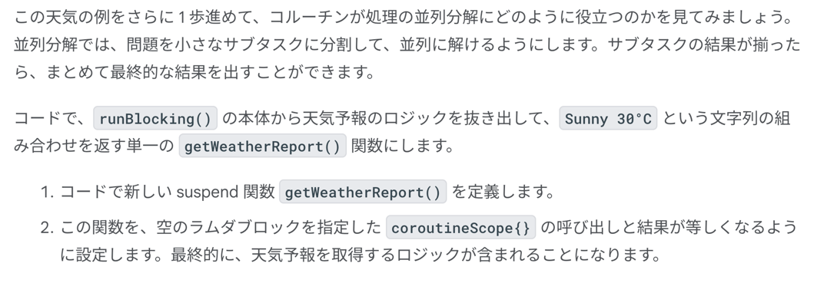
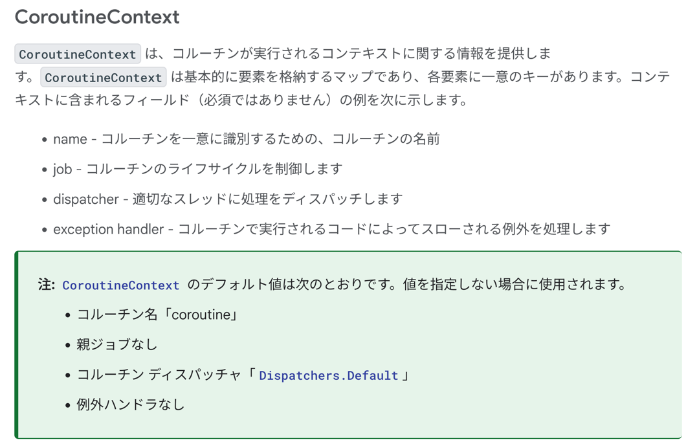

### 同期コード


```kotlin
fun main() {
    println("Weather forecast")
    println("Sunny")
}
```


#### 遅延を追加する

```kotlin
import kotlinx.coroutines.*

fun main() {
    println("Weather forecast")
    delay(1000)
    println("Sunny")
}
```


```kotlin
import kotlinx.coroutines.*

fun main() {
    runBlocking {
        println("Weather forecast")
        delay(1000)
        println("Sunny")
    }
}
```


#### 関数の中断


```kotlin
import kotlinx.coroutines.*

fun main() {
    runBlocking {
        println("Weather forecast")
        printForecast()
    }
}

fun printForecast() {
    delay(1000)
    println("Sunny")
}
```

delay は suspend 関数なのでそれを含んでいる printForecast() も suspend 関数だよねって話し。

suspend 関数は通常の関数に似ていますが、中断して後で再開できる。
そのために、suspend 関数は、この機能を利用できるようにする他の suspend 関数からしか呼び出すことができない。

suspend 関数には 0 個以上の中断ポイントを含めることができる。
中断ポイントは、関数の実行を中断できる、関数内の場所。
実行が再開されると、コード内の最後に中断したところから再開して、関数の残りの部分に進む。
具体的なコードが欲しいね。

```kotlin
import kotlinx.coroutines.delay
import kotlinx.coroutines.runBlocking

fun main() {
    runBlocking {
        println("Weather forecast")
        printForecast()
        printTemperature()
    }
}

suspend fun printForecast() {
    delay(1000)
    println("Sunny")
}

suspend fun printTemperature() {
    delay(1000)
    println("30\u00b0C")
}
```

```text
// 出力   
    Weather forecast
    Sunny
    30°C
Process finished with exit code 0
```


### 非同期コード


に従っています。

```kotlin
import kotlinx.coroutines.*

fun main() {
    runBlocking {
        println("Weather forecast")
        launch {
            printForecast()
        }
        launch {
            printTemperature()
        }
    }
}

suspend fun printForecast() {
    delay(1000)
    println("Sunny")
}

suspend fun printTemperature() {
    delay(1000)
    println("30\u00b0C")
}
```


```kotlin
fun main() {
    val time = measureTimeMillis {
        runBlocking {
            println("Weather forecast")
            launch {
                printForecast()
            }
            launch {
                printTemperature()
            }
        }
    }
    println("Execution time: ${time / 1000.0} seconds")
}
```

```text
Weather forecast
Sunny
30°C
Execution time: 1.065 seconds
```


```kotlin
fun main() {
    runBlocking {
        println("Weather forecast")
        launch {
            printForecast()
        }
        launch {
            printTemperature()
        }
        println("Have a good day!")
    }
}
```

```text
Weather forecast
Have a good day! <-- ここに注目ね
Sunny
30°C
Execution time: 1.063 seconds
```

これが launch を使った非同期処理
Have a good day は先に実行される

#### async()

```kotlin
fun main() {
    runBlocking {
        println("Weather forecast")
        val forecast: Deferred<String> = async {
            getForecast()
        }
        val temperature: Deferred<String> = async {
            getTemperature()
        }
        println("${forecast.await()} ${temperature.await()}")
        println("Have a good day!")
    }
}

suspend fun getForecast(): String {
    delay(1000)
    return "Sunny"
}

suspend fun getTemperature(): String {
    delay(1000)
    return "30\u00b0C"
}
```


#### 並列分解



```kotlin
fun main() {
    runBlocking {
        println("Weather forecast")
        println(getWeatherReport())
        println("Have a good day!")
    }
}

suspend fun getWeatherReport() = coroutineScope {
    val forecast = async { getForecast() }
    val temperature = async { getTemperature() }
    "${forecast.await()} ${temperature.await()}"
}

suspend fun getForecast(): String {
    delay(1000)
    return "Sunny"
}

suspend fun getTemperature(): String {
    delay(1000)
    return "30\u00b0C"
}
```


### 例外とキャンセル

```kotlin
fun main() {
    runBlocking {
        println("Weather forecast")
        println(getWeatherReport())
        println("Have a good day!")
    }
}

suspend fun getWeatherReport() = coroutineScope {
    val forecast = async { getForecast() }
    val temperature = async { getTemperature() }
    "${forecast.await()} ${temperature.await()}"
}

suspend fun getForecast(): String {
    delay(1000)
    return "Sunny"
}

suspend fun getTemperature(): String {
    delay(500)
    throw AssertionError("Temperature is invalid")
    return "30\u00b0C"
}
```

重要なのは、getTemperture で落ちるのが runBlocking に伝播して、
getForecast も同時に落ちること。

```kotlin
fun main() {
    runBlocking {
        println("Weather forecast")
        try {
            println(getWeatherReport())
        } catch (e: AssertionError) {
            println("Caught exception in runBlocking(): $e")
            println("Report unavailable at this time")
        }
        println("Have a good day!")
    }
}

suspend fun getWeatherReport() = coroutineScope {
    val forecast = async { getForecast() }
    val temperature = async { getTemperature() }
    "${forecast.await()} ${temperature.await()}"
}

suspend fun getForecast(): String {
    delay(1000)
    return "Sunny"
}

suspend fun getTemperature(): String {
    delay(500)
    throw AssertionError("Temperature is invalid")
    return "30\u00b0C"
}
```

```text
Weather forecast
Caught exception in runBlocking(): java.lang.AssertionError: Temperature is invalid
Report unavailable at this time
Have a good day!
```

気温は取得できた方がよくね？ということで。

```kotlin
fun main() {
    runBlocking {
        println("Weather forecast")
        println(getWeatherReport())
        println("Have a good day!")
    }
}

suspend fun getWeatherReport() = coroutineScope {
    val forecast = async { getForecast() }
    val temperature = async {
        try {
            getTemperature()
        } catch (e: AssertionError) {
            println("Caught exception $e")
            "{ No temperature found }"
        }
    }

    "${forecast.await()} ${temperature.await()}"
}

suspend fun getForecast(): String {
    delay(1000)
    return "Sunny"
}

suspend fun getTemperature(): String {
    delay(500)
    throw AssertionError("Temperature is invalid")
    return "30\u00b0C"
}
```

```text
Weather forecast
Caught exception java.lang.AssertionError: Temperature is invalid
Sunny { No temperature found }
Have a good day!
```


#### キャンセル

```kotlin
fun main() {
    runBlocking {
        println("Weather forecast")
        println(getWeatherReport())
        println("Have a good day!")
    }
}

suspend fun getWeatherReport() = coroutineScope {
    val forecast = async { getForecast() }
    val temperature = async { getTemperature() }

    delay(200)
    temperature.cancel()

    "${forecast.await()}"
}

suspend fun getForecast(): String {
    delay(1000)
    return "Sunny"
}

suspend fun getTemperature(): String {
    delay(1000)
    return "30\u00b0C"
}
```

```text
Weather forecast
Sunny
Have a good day!
```


### コルーチンのコンセプト


#### ジョブ

launch{} の戻り値は Deferred (Deferred : Jobって感じかな)であり、当然 Job でもあるってこと。
当然なのは継承しているっぽいので。
ジョブはタスクが不要になったらこルーチンをキャンセルするなど、存在期間を制御するために使用できるよと。
Java の　Thread.stop() みたいなことを言ってるな多分。


ジョブの階層について


親のキャンセルはこのキャンセル
子のキャンセルは子のみに適用される
子ジョブが例外で失敗した場合、親ジョブもキャンセルされる。
    回避するには try-catch で拾うしかない


おっしゃる通りですね


#### CoroutineContext




やべえ意味わかんねえ

#### ディスパッチャ

何言ってんのか意味わからないんだけど、Android には UI スレッドとバックグラウンドスレッドがある。
UI スレッドは UI の更新、操作の迅速な処理のために使われる。
API 通信などは当然バックグラウンドスレッドを使うべきなので、Dispatchers.IO を選択するべきだよねって話。


```kotlin
import kotlinx.coroutines.*

fun main() {
    runBlocking {
        launch {
            delay(1000)
            println("10 results found.")
        }
        println("Loading...")
    }
}
```


```kotlin

fun main() {
    runBlocking {
        launch {
            withContext(Dispatchers.Default) {
                delay(1000)
                println("10 results found.")
            }
        }
        println("Loading...")
    }
}
```

WithContext() は suspend関数なので、ディスパッチャの切り替えが可能。
指定されたコードブロックを新しい CoroutineContext を使用して実行できる。
つまり、親の launch {} で適用された Dispatchers.Main が、withContext(){} で指定した Dispatchers.Default にオーバーライドされましたよっと。

```text
// 出力
Loading...
10 results found.
```


```kotlin
fun main() {
    runBlocking {
        println("${Thread.currentThread().name} - runBlocking function")
        launch {
            println("${Thread.currentThread().name} - launch function")
            withContext(Dispatchers.Default) {
                println("${Thread.currentThread().name} - withContext function")
                delay(1000)
                println("10 results found.")
            }
            println("${Thread.currentThread().name} - end of launch function")
        }
        println("Loading...")
    }
}
```

何が言えるのか？
明示的にスレッドのディスパッチャを指定しない場合、基本的に UI スレッドで処理が実行される。
行う処理に応じてそれぞれに適切なスレッドを指定してあげないといけないよねって話。


Room, Retrofit は勝手に Dispathers.IO で処理を行ってくれるので何も考えなくてもいいけど、本当は自分で明示的に変える必要があるんだよ？って話。
便利にしてくれてありがたいね。

### まとめ


概要として、結局重要なのは async, launch の挙動の違いをまとめて終了とする。