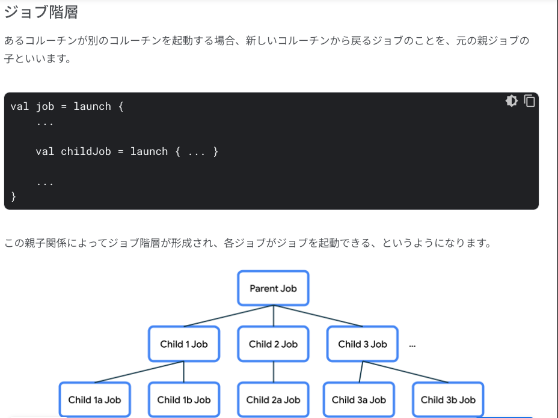

### Coroutine の概要
非同期処理を Android というプラットフォームでどう扱う？を解決してくれる Kotlin 標準のライブラリ.

#### launch
`launch`: 新しい子ルーチンを起動するもの。
- タスクを同時実行するためには複数の launch 関数をコードに追加し、複数の子ルーチンを同時進行できるようにする
- 以下のように、launch 関数で suspend 関数を呼び出すことで非同期処理を同時実行することができる
  -  
  - 
- 上記のような動作をするので、launch 関数の後に適当なコードを追加すると、そちらの処理の実行速度が launch 関数にわたした処理よりも早ければ先に実行される
  - 
  - 
  - 
- launch の本質は打ちっぱなし、やりっぱなし
- runBlocking 等の呼び出し元は、与えた launch 関数が全て完了したら終了する
- エラーや例外が漏れることはないので、都度拾うことができる

#### async, await
`async()`: 2つ以上の非同期処理の結果を元に何かしらの処理をしたい場合に使う。launch ではそれぞれ独立した処理として流れるので、そこをカバーするために作られたのかな。。
- 以下のように呼び出してあげると、println() 以降の処理が、forecast, temperature の処理完了を待ってくれる。
  - 
  - 実行結果
  - 
- async の詳細な使い方は Now in Android の該当部分を見た方が良い
  - 

#### 並列分解
- 目的: 問題を小さなサブタスクに分割して並列に溶けるようにすること。サブタスクの結果が揃ったら、まとめて最終結果を出すことができる。
- 例で何をしたいのか: コードで、runBlocking() の本体から天気予報のロジックを抜き出して、Sunny 30°C という文字列の組み合わせを返す単一の getWeatherReport() 関数にします。
  - コード
  - 
  - 出力
  - 
- coroutineScope について
  - coroutineScope() は起動した子ルーチンを含む全ての処理が完了した場合にのみ返される
  - サンプルコードの場合、getForecast() と getTemperature() の両方が終了し、
  - Sunny テキストと 30°C が組み合わされ、スコープから返されます。この Sunny 30°C という天気予報が出力され、呼び出し元は Have a good day! という最後の print ステートメントに進むことができます
  - 
  - 呼び出し的には同期オペレーションに見えるが、内部では非同期を行なっているっていうのが味噌で、目的に合致していると思う
- 構造化された同時実行に関する重要な点は、複数の同時実行オペレーションを単一の同期オペレーションにまとめることができること
- 呼び出しコードの唯一の要件は suspend関数 or コルーチンであることで、それ以外に呼び出しもとで同時実行の詳細を考慮する必要はない

#### 例外とキャンセル
try-catch で囲もうねって話。
codelab の流れは、
- getTemperature で throw AssertionError を投げる
  - getWeatherReport() 関数の全体を try-catch で囲む
  - 
  - getWeatherReport() 関数で async して getTemperture() を try-catch で囲む↓
  - 
  - async は例外をキャッチして処理して String を返却できる
- launch, async で try-catch の挙動はどう変わるのか？
  - 
  - 
  - 
- キャンセル
  - コルーチンは単体でキャンセルできるし、キャンセルは例外と違って親に伝搬されない

#### 構造化された同時実行


```kotlin
fun main() = runBlocking { // this: CoroutineScope
    launch { // launch a new coroutine and continue
        delay(1000L) // non-blocking delay for 1 second (default time unit is ms)
        println("World!") // print after delay
    }
    println("Hello") // main coroutine continues while a previous one is delayed
}
```

```text
構造化された同時実行
コルーチンは構造化並行性の原則に従っており、新しいコルーチンはコルーチンのライフタイムを区切る特定のCoroutineScopeでのみ起動できる。
上の例は、runBlockingが対応するスコープを確立することを示しており、そのため、前の例では1秒遅れてWorld!

実際のアプリケーションでは、多くのコルーチンを起動することになる。
構造化された並行処理によって、コルーチンが失われたりリークしたりすることはありません。外部スコープは、そのすべての子コルーチンが完了するまで完了することができません。構造化された並行処理によって、コードのエラーは適切に報告され、失われることはありません。
```
#### Coroutine の親子階層の注意点について

- 
- 
  - 親ジョブのキャンセル=子ジョブのキャンセル
  - 子ジョブのキャンセル≠親ジョブのキャンセル
  - 子ジョブで例外発生=親ジョブへキャンセルが伝搬し、親ジョブがキャンセル
    - なので子ジョブでちゃんと例外処理しないとNG
      - 処理する場合、Exception を e: Exception みたいにしてはいけない


#### ディスパッチャーについて


#### 注意点
- main 関数で runBlocking を使用するのは学習用途だけ
  - main 関数は UI スレッド、rubBlocking はこの UI スレッドをブロックするため、UI スレッド(UI の描画)を止めてしまうから
- 