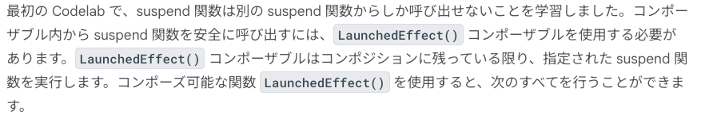
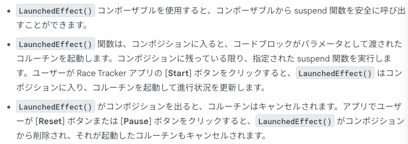
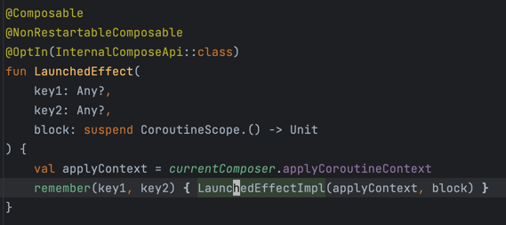
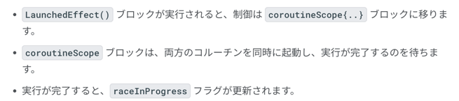
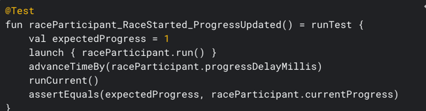
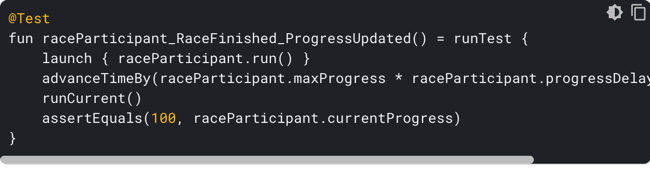

### 実装前メモ


このディレクトリ構成から、RaceParticipant がモデルの役割をしている感じ。
今までの State と違うのはそれぞれのプレイヤーに応じてインスタンス作りたいから。

### LaunchedEffect について



UI(コンポーザブル)から suspend 関数を安全に呼び出すときに使うコンポーネント。
LaunchedDffect はコンポジションに残っている限り、指定された suspend 関数を実行する。
以下ができること。



LaunchedEffect は、指定したコードブロックをこルーチンで実行する。
明示的にキャンセルしてあげるか、コンポジションを出るとコルーチンはキャンセルされる。

ディスパッチャは LaunchedEffect がいい感じにやってくれるので指定しなくて良い。



子ルーチンのコンテキストは現在の Compose の Context にしたがう。
LaunchedEffect の実装。key1,2 を受け取って remember(Any, Any) {} を呼ぶ。
remember(Any, Any) {} の実装を見た感じだと、過去の @Composable の状態を新しい状態と比較して、再コンポジションするかどうかを決めているっぽい。
calculation を返すって書いてあるけど、この記述はちょっとよくわからん。

```kotlin
@Composable
@NonRestartableComposable
@OptIn(InternalComposeApi::class)
fun LaunchedEffect(
    key1: Any?,
    key2: Any?,
    block: suspend CoroutineScope.() -> Unit
) {
    val applyContext = currentComposer.applyCoroutineContext
    remember(key1, key2) { LaunchedEffectImpl(applyContext, block) }
}
```

```kotlin
        LaunchedEffect(playerOne, playerTwo) {
    coroutineScope {
        launch {
            playerOne.run()
        }
        launch {
            playerTwo.run()
        }
    }
    raceInProgress = false
}
```



- coroutineScope{} で囲っているので、launch{} がそれぞれ終わるまで raceInProgress フラグは更新されない。

#### コルーチンの単体テスト

import ライブラリ
```kotlin
dependencies {
    ...
    testImplementation("org.jetbrains.kotlinx:kotlinx-coroutines-test:1.6.4")
}
```

基本的に Viewmodel とかのテストと同じ。
差分は以下.
runTest ブロックで囲っているのが主な違い

```kotlin
class RaceParticipantTest {
  private val raceParticipant = RaceParticipant(
    ...
  )

  @Test
  fun raceParticipant_RaceStarted_ProgressUpdated() = runTest {
  }
}
```

愚直に実行時間を待つのではなく、時飛ばししてくれる関数が用意されているので使う
時飛ばしというよりは、書いてあるコードをそのまま実行してくれるものっぽい？(delay とかあっても無視して次のコード実行しちゃう的な動きかな。。)
```kotlin
    advanceTimeBy(raceParticipant.progressDelayMillis)
```

1. 指定した delay の時間分、run した時に期待される currentProgress のテスト
   2. 
3. 100% に至るまでに必要な時間分、run したときに進捗が 100 であることを確認するテスト
   4. 
5. 境界値分析的なテストをしてあげようねって話しで終わり。
   6. 今回の強化位置分析に使う値は以下
      7. -50,-1,0,1,50,99,100,101, 150

### 完了後メモ

ViewModelScope.launch{} を使って、Repository とかを操作するのかと思ったけど、そうじゃなくて UI から直接モデルの関数を実行するやり方だった。
LaunchedEffect コンポーネントで実装できるみたいだけど、本番の実装で使うと思えない。
が、以下の点は学べた。
- launch の使い方
- coroutineScope の使い方
  - lauch{} で非同期処理を実行すると、launch{} 以降のコードが launch が完了するまで実行されない
  - つまり、同期処理っぽく見えているよねって前章でやったこと