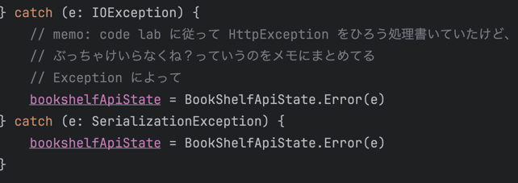

## メモ

### Gemini の使い方
モデルの実装は Gemini にやらせた方が楽なので今後は全部そうする。


こんな感じで注文すれば、、、

```kotlin
data class Book(
    val kind: String,
    val id: String,
    val etag: String,
    val selfLink: String,
    val volumeInfo: com.example.compose.unit5.showImageFromInternet.bookshelf.model.books.VolumeInfo,
    val saleInfo: com.example.compose.unit5.showImageFromInternet.bookshelf.model.books.SaleInfo,
    val accessInfo: com.example.compose.unit5.showImageFromInternet.bookshelf.model.books.AccessInfo,
    val searchInfo: com.example.compose.unit5.showImageFromInternet.bookshelf.model.books.SearchInfo
)

data class com.example.compose.unit5.showImageFromInternet.bookshelf.model.books.VolumeInfo(
    val title: String,
    val authors: List<String>,
    val publishedDate: String,
    val description: String,
    val industryIdentifiers: List<com.example.compose.unit5.showImageFromInternet.bookshelf.model.books.IndustryIdentifier>,
    val readingModes: com.example.compose.unit5.showImageFromInternet.bookshelf.model.books.ReadingModes,
    val printType: String,
    val categories: List<String>,
    val maturityRating: String,
    val allowAnonLogging: Boolean,
    val contentVersion: String,
    val panelizationSummary: com.example.compose.unit5.showImageFromInternet.bookshelf.model.books.PanelizationSummary,
    val language: String,
    val previewLink: String,
    val infoLink: String,
    val canonicalVolumeLink: String
)

data class com.example.compose.unit5.showImageFromInternet.bookshelf.model.books.IndustryIdentifier(
    val type: String,
    val identifier: String
)

data class com.example.compose.unit5.showImageFromInternet.bookshelf.model.books.ReadingModes(
    val text: Boolean,
    val image: Boolean
)

data class com.example.compose.unit5.showImageFromInternet.bookshelf.model.books.PanelizationSummary(
    val containsEpubBubbles: Boolean,
    val containsImageBubbles: Boolean
)

data class com.example.compose.unit5.showImageFromInternet.bookshelf.model.books.SaleInfo(
    val country: String,
    val saleability: String,
    val isEbook: Boolean
)

data class com.example.compose.unit5.showImageFromInternet.bookshelf.model.books.AccessInfo(
    val country: String,
    val viewability: String,
    val embeddable: Boolean,
    val publicDomain: Boolean,
    val textToSpeechPermission: String,
    val epub: com.example.compose.unit5.showImageFromInternet.bookshelf.model.books.Epub,
    val pdf: com.example.compose.unit5.showImageFromInternet.bookshelf.model.books.Pdf,
    val webReaderLink: String,
    val accessViewStatus: String,
    val quoteSharingAllowed: Boolean
)

data class com.example.compose.unit5.showImageFromInternet.bookshelf.model.books.Epub(
    val isAvailable: Boolean
)

data class com.example.compose.unit5.showImageFromInternet.bookshelf.model.books.Pdf(
    val isAvailable: Boolean
)

data class com.example.compose.unit5.showImageFromInternet.bookshelf.model.books.SearchInfo(
    val textSnippet: String
)
```

こんなふうに起こしてくれる。


### ViewModel でエラーハンドリングをする

#### 前提
```kotlin
import kotlinx.serialization. Serializable
import retrofit2.http.GET
import retrofit2.http.Path
import retrofit2.http.Query
```
を使って API 通信をしていて、エラーハンドリングをする場合。

catch するべき API エラーは以下で十分かな


codelab では HttpException を拾うように今まで習ってきたけど、これ実装すると Android12 以上がマストになるので NG だと思う。
HttpException は IOException を継承しているだけなので。


## 感想
何でこんなに時間がかかったかって？
1. API 仕様がちゃんと固まってないからだよ！！！！！
   2. nullable なのか レスポンスごとにあるパラメータなのかどうかちゃんと書いてくれよ！って言いたい


コンテナで Retrofit で使う Json コンバータに対して、モデルに定義していないパラメータを無視させる設定
```kotlin
    private val json = Json {
        ignoreUnknownKeys = true
    }
    private val bookShelfRetrofit: Retrofit = Retrofit.Builder()
        .baseUrl(baseUrl)
        .addConverterFactory(json.asConverterFactory("application/json".toMediaType()))
        .build()
```