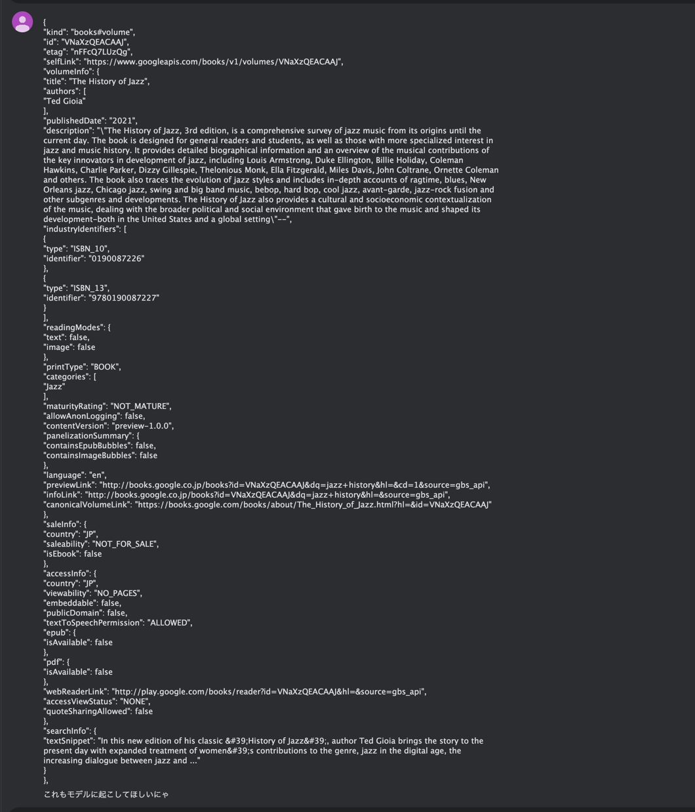

## メモ

モデルの実装は Gemini にやらせた方が楽なので今後は全部そうする。



こんな感じで注文すれば、、、

```kotlin
data class Book(
    val kind: String,
    val id: String,
    val etag: String,
    val selfLink: String,
    val volumeInfo: VolumeInfo,
    val saleInfo: SaleInfo,
    val accessInfo: AccessInfo,
    val searchInfo: SearchInfo
)

data class VolumeInfo(
    val title: String,
    val authors: List<String>,
    val publishedDate: String,
    val description: String,
    val industryIdentifiers: List<IndustryIdentifier>,
    val readingModes: ReadingModes,
    val printType: String,
    val categories: List<String>,
    val maturityRating: String,
    val allowAnonLogging: Boolean,
    val contentVersion: String,
    val panelizationSummary: PanelizationSummary,
    val language: String,
    val previewLink: String,
    val infoLink: String,
    val canonicalVolumeLink: String
)

data class IndustryIdentifier(
    val type: String,
    val identifier: String
)

data class ReadingModes(
    val text: Boolean,
    val image: Boolean
)

data class PanelizationSummary(
    val containsEpubBubbles: Boolean,
    val containsImageBubbles: Boolean
)

data class SaleInfo(
    val country: String,
    val saleability: String,
    val isEbook: Boolean
)

data class AccessInfo(
    val country: String,
    val viewability: String,
    val embeddable: Boolean,
    val publicDomain: Boolean,
    val textToSpeechPermission: String,
    val epub: Epub,
    val pdf: Pdf,
    val webReaderLink: String,
    val accessViewStatus: String,
    val quoteSharingAllowed: Boolean
)

data class Epub(
    val isAvailable: Boolean
)

data class Pdf(
    val isAvailable: Boolean
)

data class SearchInfo(
    val textSnippet: String
)
```

こんなふうに起こしてくれる。