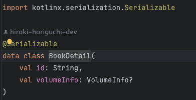
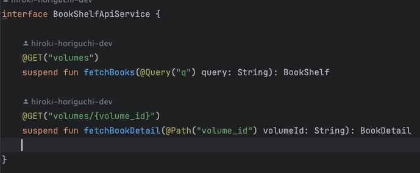
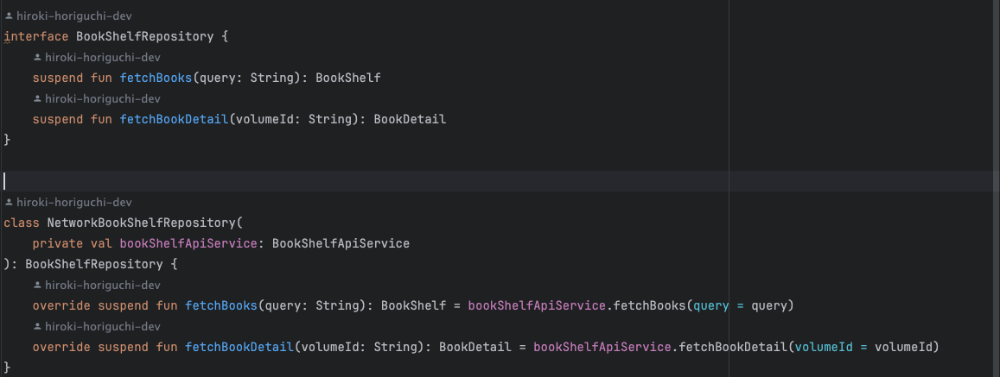
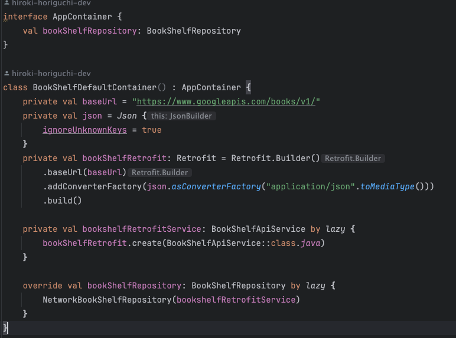
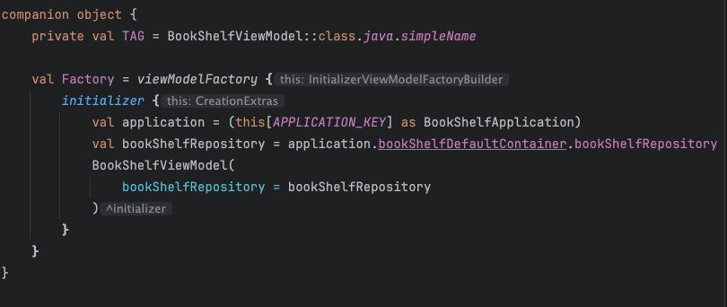
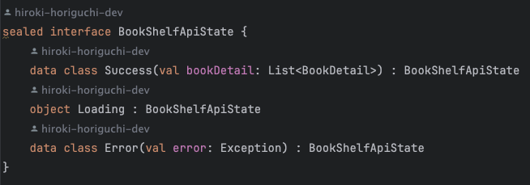
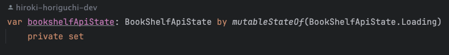
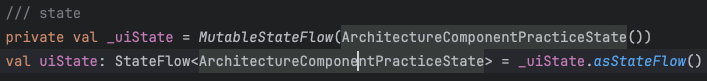
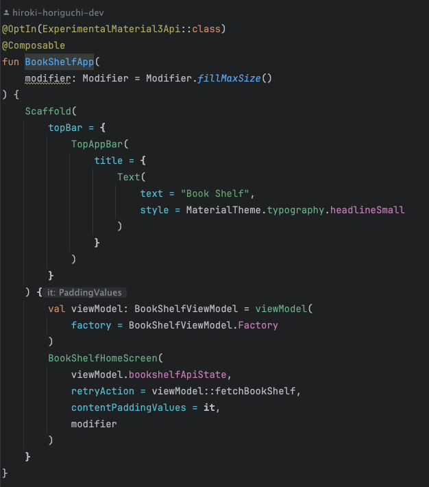
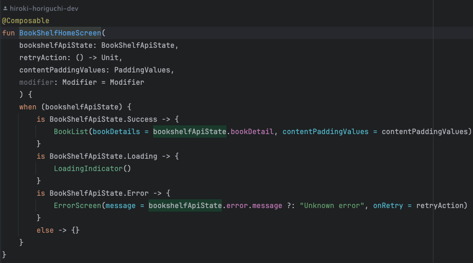

## 復習

一連の Codelab で学習するべき内容は以下を目標としていた
1. API 通信処理をサクッと描けるようになること
2. UI は一旦雑でいい

## どう言う順序でコミット単位をきればよかったのか？

今回やってみて、以下の流れが一番適当だと思う
1. モデルの作成 ../models/
   1. 叩く API のパラメータに相当する data class の作成 (アプリで使う必須パラメータのみ抜粋) 
   2. 
2. API サービスの実装 ../network/
   1. 叩く API のクエリ、ヘッダーを定義したサービスの作成 
   2. 
3. Repository の実装 ../data/
   1. 実際に API サービスで定義した叩く API の詳細を呼び出すリポジトリーの作成 
   2. 
4. Container の作成
   1. API のホスト名、`Apiレスポンス.json → モデル(data class)` へコンバートするときに使うコンバーター(`kotlin.serialization` or `Gson` or `moshi`)の定義
   2. 
5. ViewModel の作成
   1. Facroty メソッドの作成
      1. 
   2. 画面に表示する State の定義
      1. 今回は API のレスポンスによって State が変化するので、その State を定義
      2. 
      3. 
      4. private set にすることで、定義されたファイル外からの変更不能にする点がめちゃメリット
      5. 初期値を Loading とする
      6. もちろん、API のレスポンスではなく複数画面で使いまわしたい State があるならこういう定義をする
      7. 
      8. この場合は MutableStateFlow, StateFlow, 更新時には update{ it.copy{} } を使うことで State 管理をする
6. UI を作成し、繋ぎこむ
   1. 画面の種別毎にうまく分割していけばいいんだけど、大元の App クラスを作り、そこから viewmodel の state, action を定義して渡す
   2. 
   2. State の状態によって Composable を出し分ける
   3. 