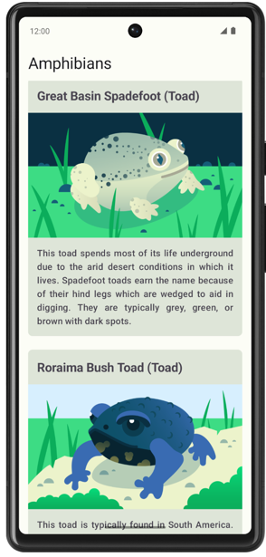

## はじめに
このユニットでは、インターネットからデータを取得してアプリをワンランク アップさせる方法を学習しました。
アプリは、サーバーから利用可能な最新のデータを表示できるようになり、開いたときに静的に利用可能だったデータのみに限定されなくなりました。
これは、実際のアプリのほとんどで非常に重要な機能です。

この演習セットでは、学習したコンセプトを活用して Amphibians アプリを作成します。
このアプリは、インターネットから両生類のデータを取得し、スクロール リストに表示します。

解答コードは最後にあります。
この学習体験を最大限に活用するため、記載された解答コードを確認する前に、
できる限りご自身で実装とトラブルシューティングを行ってみてください。
この実践時間中に、多くのことを学びましょう。

## 前提条件
Codelab インターネットから画像を読み込んで表示するの「Compose を用いた Android アプリ開発の基礎」コースワークを完了していること。

### 必要なもの
Android Studio がインストールされた、インターネットに接続できるパソコン
作成するアプリの概要
この演習セットでは、両生類のリストと、その詳細や画像を表示するアプリを作成します。データは、ネットワーク リクエストによってインターネットから取得します。これには、それぞれの両生類の名前、種類、説明、画像の URL が含まれます。

両生類の JSON データは https://android-kotlin-fun-mars-server.appspot.com/amphibians でホストされています。

提示されている解答コードでは、以下の UI デザインが表示されます。

