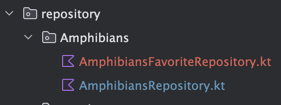
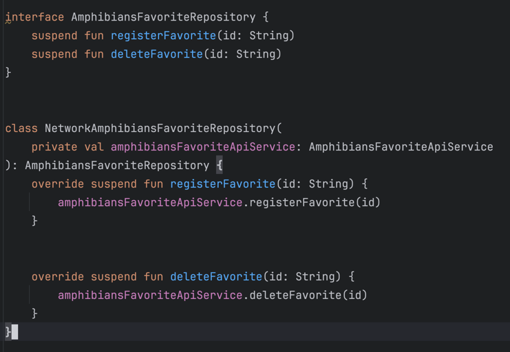
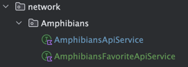
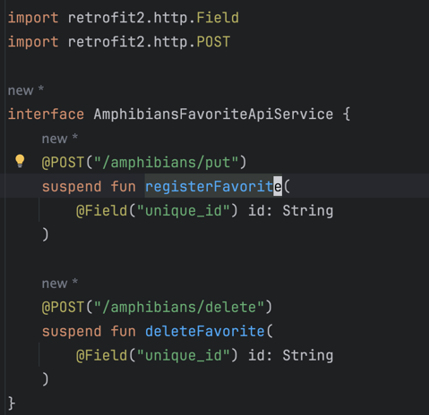
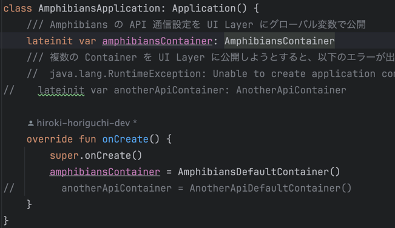
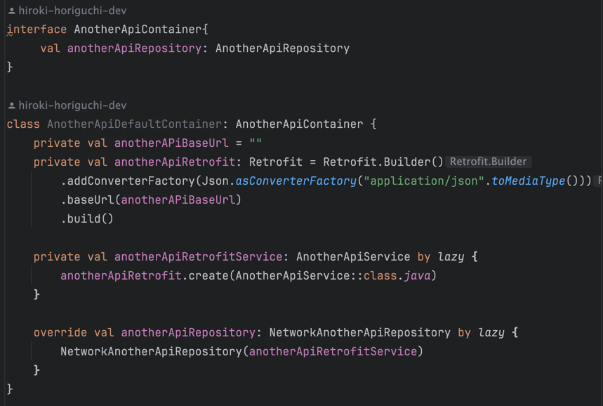
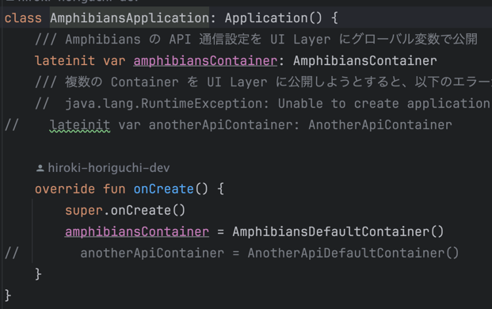

## はじめに
このユニットでは、インターネットからデータを取得してアプリをワンランク アップさせる方法を学習しました。
アプリは、サーバーから利用可能な最新のデータを表示できるようになり、開いたときに静的に利用可能だったデータのみに限定されなくなりました。
これは、実際のアプリのほとんどで非常に重要な機能です。

この演習セットでは、学習したコンセプトを活用して Amphibians アプリを作成します。
このアプリは、インターネットから両生類のデータを取得し、スクロール リストに表示します。

解答コードは最後にあります。
この学習体験を最大限に活用するため、記載された解答コードを確認する前に、
できる限りご自身で実装とトラブルシューティングを行ってみてください。
この実践時間中に、多くのことを学びましょう。

## 前提条件
Codelab インターネットから画像を読み込んで表示するの「Compose を用いた Android アプリ開発の基礎」コースワークを完了していること。

### 必要なもの
Android Studio がインストールされた、インターネットに接続できるパソコン
作成するアプリの概要
この演習セットでは、両生類のリストと、その詳細や画像を表示するアプリを作成します。データは、ネットワーク リクエストによってインターネットから取得します。これには、それぞれの両生類の名前、種類、説明、画像の URL が含まれます。

両生類の JSON データは https://android-kotlin-fun-mars-server.appspot.com/amphibians でホストされています。

提示されている解答コードでは、以下の UI デザインが表示されます。


### 実装に必要な道具

ライブラリ
```kotlin
    // Retrofit
    implementation("com.squareup.retrofit2:retrofit:2.9.0")
    // Retrofit with Kotlin serialization Converter
    implementation("com.jakewharton.retrofit:retrofit2-kotlinx-serialization-converter:1.0.0")
    implementation("com.squareup.okhttp3:okhttp:4.11.0")
    // Kotlin serialization
    implementation("org.jetbrains.kotlinx:kotlinx-serialization-json:1.5.1")
    // Coil
    implementation("io.coil-kt:coil-compose:2.4.0")
```

### メモ

実装するのは別に問題ないので、こういう場合はどうする？を考えてみた。。

#### その１叩きたい API のドメインで以下のような区分があったらどうする？

amphibians を商品情報として、そのほかにも API に色々なジャンル(区分)があるとしたらどうする？を考える。

```text
- android-kotlin-fun-mars-server.appspot.com
    - 商品関連
        - /amphibians
        - /amphibians/
    - お気に入り関連
        - /amphibians/put (POST)
        - /amphibians/delete
    - ユーザー情報関連
        - /login (POST)
        - /logout (POST)
    etc...
```

この場合は簡単で、以下のようにすれば良い
1. ApiService, ApiRepository をそれぞれの関連領域について作成する
   1. 
   2. 
   3. 
   4. 
2. 上記のようにして、AmphibiansApplication クラスで公開してる amphibiansContainer を介して ViewModel に適切な窓口を渡して通信させればいい。
3. 

#### その2 叩きたい API のドメインが2種類以上あったらどうする？を考えてみた

単純な発想で、Container にその都度追加して onCreate で初期化して公開したらいいじゃん！
と思ったが、Application クラスを作れないよエラーでアプリが落ちるので NG 。。
どうすればいいかな。。Dagger Hilt で解消できるんだっけ・・？

```text
FATAL EXCEPTION: main
Process: com.example.compose, PID: 1729
java.lang.RuntimeException: Unable to create application com.example.compose.unit5.showImageFromInternet.practice_Amphibians.AmphibiansApplication: java.lang.IllegalArgumentException: Expected URL scheme 'http' or 'https' but no scheme was found for 
```



こういうのを作って、Application クラスでこうやればいいじゃん！って発想では NG みたい。。


