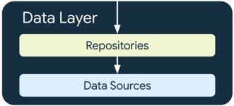
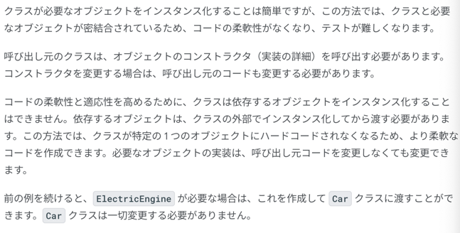

### UI レイヤとデータレイヤを分離する

推奨アーキテクチャ


- UI Layer
- Data Layer
の存在が必須(domain Layer は必須ではない)


Data Layer の構成要素



- Repository が Data Sources の操作を全て提供し、カプセル化しておく
- UI Layer から Data Sources を直接操作しない


#### データレイヤの追加


ViewModel で data に直接アクセスするのではなく、Repository を介しただけ。


#### 依存関係インジェクション
クラスで必要なオブジェクトを取得する方法は以下の 2つ.
1. クラスが必要なオブジェクトをインタンス化すること
   1. 
   2. こちらの方法は簡単だが、クラスと必要なオブジェクトが見つけ都合されているので、コードの柔軟性がなく、テストが難しい
2. 必要なオブジェクトを引数として渡すこと
   1. 
   2. コードの柔軟性と適応性を高めるためには、クラスが依存するオブジェクトをクラスの外でインスタンス化してから渡す必要がある。
   3. この方法では、クラスが特定の1つのオブジェクトにハードコードされなくなるので、より柔軟。
3.  


クラスの外でインスタンス化してオブジェクトを渡す場合、


ElectricEngine が追加で必要な場合、ElectricEngine のインスタンスを car に渡すことができる。


言いたいことはなんとなくわかるけど、言葉だと的をえないのでコードみる。

#### DI とは

DI とは、呼び出し元クラスにハードコードされるのではなく、実行時に依存関係を提供することを指します。


これ忘れそうになったら、ui/injection にある injectionSample を見てね


#### コンテナとは


以下の例のミソは2つ
- Application クラスを継承した MyApplication クラスで Data Layer とのやりとりを一元化する appContainer 変数を作成して、public で公開する
  - Data Layer と UI Layer のやりとりをする上でファサード(またはインターフェース)になっているかんじ
- 全ての UI Layer (ViewModel or UseCase) から API 通信処理、DB 処理を呼ぶことができ、実際の処理は Repository がカプセル化している

```kotlin
// Container of objects shared across the whole app
class AppContainer {

    // Since you want to expose userRepository out of the container, you need to satisfy
    // its dependencies as you did before
    private val retrofit = Retrofit.Builder()
                            .baseUrl("https://example.com")
                            .build()
                            .create(LoginService::class.java)

    private val remoteDataSource = UserRemoteDataSource(retrofit)
    private val localDataSource = UserLocalDataSource()

    // userRepository is not private; it'll be exposed
    val userRepository = UserRepository(localDataSource, remoteDataSource)
}
```

```kotlin
// Custom Application class that needs to be specified
// in the AndroidManifest.xml file
class MyApplication : Application() {

    // Instance of AppContainer that will be used by all the Activities of the app
    val appContainer = AppContainer()
}
```


実際に UI Layer から叩く方法ね

```kotlin
class LoginActivity: Activity() {

    private lateinit var loginViewModel: LoginViewModel

    override fun onCreate(savedInstanceState: Bundle?) {
        super.onCreate(savedInstanceState)

        // Gets userRepository from the instance of AppContainer in Application
        val appContainer = (application as MyApplication).appContainer
        loginViewModel = LoginViewModel(appContainer.userRepository)
    }
}
```

こうやって Activity で ViewModel のインスタンスを生成するときに MyApplication の appContainer を渡して ViewModel で通信処理をする時に使う

ViewModel はこう実装してあげれば良い

```kotlin
// Definition of a Factory interface with a function to create objects of a type
interface Factory<T> {
    fun create(): T
}

// Factory for LoginViewModel.
// Since LoginViewModel depends on UserRepository, in order to create instances of
// LoginViewModel, you need an instance of UserRepository that you pass as a parameter.
class LoginViewModelFactory(private val userRepository: UserRepository) : Factory
```

Factory を実装するとなんやよくわからんけど、これで ViewModel に引数を渡すことができるみたい.
理由はあれだけど、ファクトリー便利だよね、どうやってインスタンス化されるのかを、される側が握ってるし。

AppContainer への実装方法と Activity からの呼び出し方法は以下

```kotlin
// AppContainer can now provide instances of LoginViewModel with LoginViewModelFactory
class AppContainer {
    ...
    val userRepository = UserRepository(localDataSource, remoteDataSource)

    val loginViewModelFactory = LoginViewModelFactory(userRepository)
}

class LoginActivity: Activity() {

    private lateinit var loginViewModel: LoginViewModel

    override fun onCreate(savedInstanceState: Bundle?) {
        super.onCreate(savedInstanceState)

        // Gets LoginViewModelFactory from the application instance of AppContainer
        // to create a new LoginViewModel instance
        val appContainer = (application as MyApplication).appContainer
        loginViewModel = appContainer.loginViewModelFactory.create()
    }
}
```

#### 注意点


これを解決するのが Dagger Hilt ってことなのかねえ。。

#### ViewModel に引数が渡せない？！


#### ファクトリーパターンの復習
[KotlinにおけるFactoryメソッドの実装パターン](https://qiita.com/doyaaaaaken/items/0c99da9efa7d724a0d80)
- クラスのインスタンス生成にはコンストラクタより Factory メソッドのがいいよ
- Kotlin だと書き方色々あるよ
- 大抵のケースで良いのは Companion Object で Factory メソッドをそれっぽい名前で実装する方法


```kotlin
class User(val name: String) {
    companion object {
        fun from(name: String): User {
            return User(name)
        }
    }
}
```
あ〜、これね。はいはい。Fragment のインスタンス作る時に Factory やってたわ。
あんまりメリットが分かってなかったので再認識しとこう。


### Repository のテスト
今回の Codelab における Repository の役割は、API を叩いて値を返却すること。なので、
叩く API の処理と叩いた結果をフェイクにすり替えてテストするっていうのがやりたいこと。

```kotlin
class NetworkMarsRepositoryTest {

    @Test
    fun networkMarsPhotosRepository_getMarsPhotos_verifyPhotoList() = runTest {
        val repository = NetworkMarsPhotosRepository(
            marsApiService = FakeMarsApiService()
        )
        assertEquals(FakeDataSource.photosList, repository.getMarsPhotos())
    }

}
```

### ViewModel のテスト

```kotlin
    @Test
    fun marsViewModel_getMarsPhotos_verifyMarsUiStateSuccess() =
        runTest{
            /// ViewModel に FakeRepository を与えると、init で FakeRepository.getPhotos() を呼んでくれる
            /// FakeRepository の getPhotos() は FakeDataSource.photoList を返す
            /// なので assertEquals の expected は FakeDataSource.photoList のサイズと同じはずなので、
            /// expected が以下のようになるよ
            val marsViewModel = MarsViewModel(
                marsPhotosRepository = FakeNetworkMarsPhotosRepository()
            )
            assertEquals(
                MarsUiState.Success("Success: ${FakeDataSource.photosList.size} Mars " +
                        "photos retrieved"),
                marsViewModel.marsUiState
            )
        }
```

これで良さそうに見えるけど、実行すると転けるよ。
なんでかっていうと、子ルーチンスコープのディスパッチャが ViewModel だと Main ディスパッチャで、単体テストは Main ディスパッチャに対応してないからだよ。
あれ、ViewModel って Main(UI) スレッドで叩いてるんだっけ。。？やばくね？


#### テストディスパッチャを作成しよう


rule を作ろう、ここでいうルールはテストで runTest を使う時のディスパッチャを Main に設定しようってことね


#### ViewModel のテスト(続き)

```kotlin
class MarsViewModelTest {
    @get:Rule
    val testDispatcher = TestDispatcherRule()

    @Test
    fun marsViewModel_getMarsPhotos_verifyMarsUiStateSuccess() =
        runTest{
            /// ViewModel に FakeRepository を与えると、init で FakeRepository.getPhotos() を呼んでくれる
            /// FakeRepository の getPhotos() は FakeDataSource.photoList を返す
            /// なので assertEquals の expected は FakeDataSource.photoList のサイズと同じはずなので、
            /// expected が以下のようになるよ
            val marsViewModel = MarsViewModel(
                marsPhotosRepository = FakeNetworkMarsPhotosRepository()
            )
            assertEquals(
                MarsUiState.Success("Success: ${FakeDataSource.photosList.size} Mars " +
                        "photos retrieved"),
                marsViewModel.marsUiState
            )
        }
}
```
これで testDispatcher を定義すると、ディスパッチャを Main に移せるのでテストが成功する。

