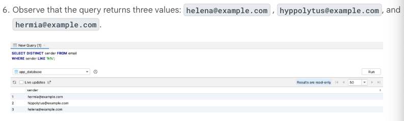

## 予習

⚠️多分 codelab ソースコードが古くて Jelly Fish で使っているコンパイルバージョンと合わないので、テキスト勉強のみとする。

#### DB とは？


これだと思っていいよ
id が主キーね

あるテーブルが別のテーブルのキーを参照するとき、そのキーのことを外部キーと呼ぶよ

知ってるわ！

#### SQLite ってなあに

Kotlin と SQL のデータ型一致表


スキーマが総称だよ


#### DB Inspector


Database Inspector で端末の DB テーブルを見ることができるよ。


実際にクエリも叩けるよ

#### SELECT

言葉の定義をちゃんと覚えておけば問題ないね

```text
Table: データの概要分類
Column: data that each row in the table contains.
Row:  actual data that consist of values for each column in the table.
```

イメージ
Columnは、列、縦


Row は、行、横


Compose と同じ


基本構文


こういう DB があった時、
```roomsql
SELECT * FROM email;
```

これでemail table のすべての Row を取得

```roomsql
SELECT subject FROM email;
```
これで subject Column を取得


```roomsql
SELECT subject, sender FROM email;
```

これで、subject, sender column を取得


#### Reduce columns with aggregate functions
```roomsql
SELECT subject FROM email;
SELECT subject, sender FROM email;
```
この辺で取得した結果に対して、フィルターやその他関数を使いたい時のやつ


max, min, sum ,count, average あたり使えるね

公式はこれ


例
```roomsql
SELECT COUNT(*) FROM email;
SELECT MAX(received) FROM email;
```

結果


#### Filter duplicate results with DISTINCT
重複排除


例
```roomsql
SELECT DISTINCT sender FROM email;
```


aggregate functions と併用することもできるよ


例
```roomsql
SELECT COUNT(DISTINCT sender) FROM email;
```


#### Filter queries with a WHERE clause

where 使ってクエリのフィルタかけようね


例
inbox が意味不明なので説明すると、ユーザーはメールボックスに trash とか spam とか作ってるかもねと
取得する email は inbox フォルダのものに限りたい、みたいな意図で書いてるみたいだね
普通テーブル分けるんじゃないの。。。？

```roomsql
SELECT * FROM email
WHERE folder = 'inbox';
```

⚠️ 注意点
kotlin と違って等値の評価は = で行うよ


#### Logical operators with WHERE clauses
if( true && false) みたいな、&& できるよ

AND 演算


OR 演算


NOT 演算


例
```roomsql
SELECT * FROM email
WHERE folder = 'inbox' AND read = false;
```

```roomsql
SELECT * FROM email
WHERE folder = 'important' OR starred = true;
```

#### Search for text using LIKE
Rowに対して text 検索ができるよ


全文一致


kotlin String.startsWith みたいなやつ


kotlin String.endWith みたいなやつ


例(組み合わせ)
```roomsql
SELECT COUNT(*) FROM email
WHERE subject LIKE '%fool%';

SELECT * FROM email
WHERE subject LIKE '%fool';

SELECT DISTINCT sender FROM email
WHERE sender LIKE 'h%';
```

結果





#### Group results with GROUP BY
group By: がさっと持ってきたデータに対して、それぞれの持つ任意のプロパティでまとめたい。というイメージかな


例
```roomsql
SELECT folder, COUNT(*) FROM email
GROUP BY folder;
```


#### ORDER BY
Order By: ソートしたい時、デフォルトは昇順、昇順以外にしたい場合に使う。

例
```roomsql
SELECT * FROM email
ORDER BY received DESC;
```


`reveived` で降順。


⚠️ 注意点
GROUP BY と ORDER BY を併用したい場合、GROUP BY が先ね


#### Restrict the number of results with LIMIT

LIMIT: 取得数の制限


OFFSET: 最初の20行のうち、11~20 行が欲しい場合に以下のように設定してね

それぞれに 10 が入るイメージ。

例
```roomsql
SELECT * FROM email
WHERE folder = 'inbox'
ORDER BY received DESC
LIMIT 10;
```

```roomsql
SELECT * FROM email
WHERE folder = 'inbox'
ORDER BY received DESC
LIMIT 10 OFFSET 10;
```

#### CRUD (Insert, update, and delete data in a database)

INSERT: Create row in table


例
```roomsql
INSERT INTO email
VALUES (
    NULL, 'Lorem ipsum dolor sit amet', 'sender@example.com', 'inbox', false, false, CURRENT_TIMESTAMP
);
```
最後尾に挿入されるかな、id が主キー

⚠️ CURRENT_TIMESTAMP について
特別変数って言ってるけど、デフォで UTC のタイムスタンプが入るだけ


UPDATE: update table in table


Set 詳細

要するにクラスのインスタンス作るのと変わらないよね


基本 WHERE が必要ですと、当然だろ。

例
```roomsql
UPDATE email
SET read = true
WHERE id = 44;
```
email table, id = 44 read flag を true に変えたい

```roomsql
SELECT read FROM email
WHERE id = 44;
```
結果が正しいか取得、ちなみに 0: false, 1: true


DELETE: そのまんま


table から 条件(whereで指定)のRow(行)を削除 


#### Summary


SELECT: 選択したテーブルから何を取る？
FROM: どのテーブルを取る？
WHERE: 取得したい Row の条件は？
GROUP BY: 取得した Row のデータが持つカラムプロパティのうち、何でまとめたい？
ORDER BY: 取得したデータの並び順をどうしたい？
LIMIT: 取得するデータの件数どうしたい？
OFFSET: 取得するデータが複数件ある場合、最初の何件スキップしたい？

以上！！！